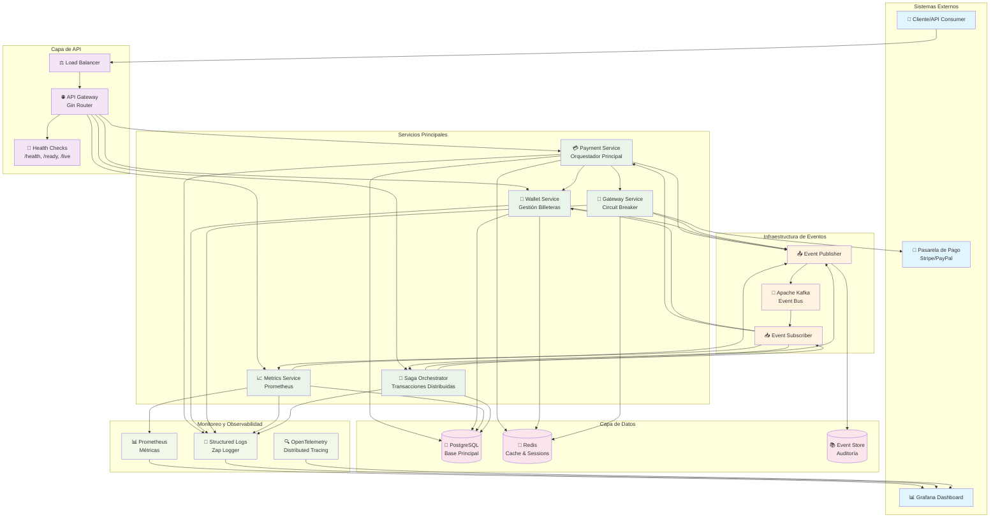
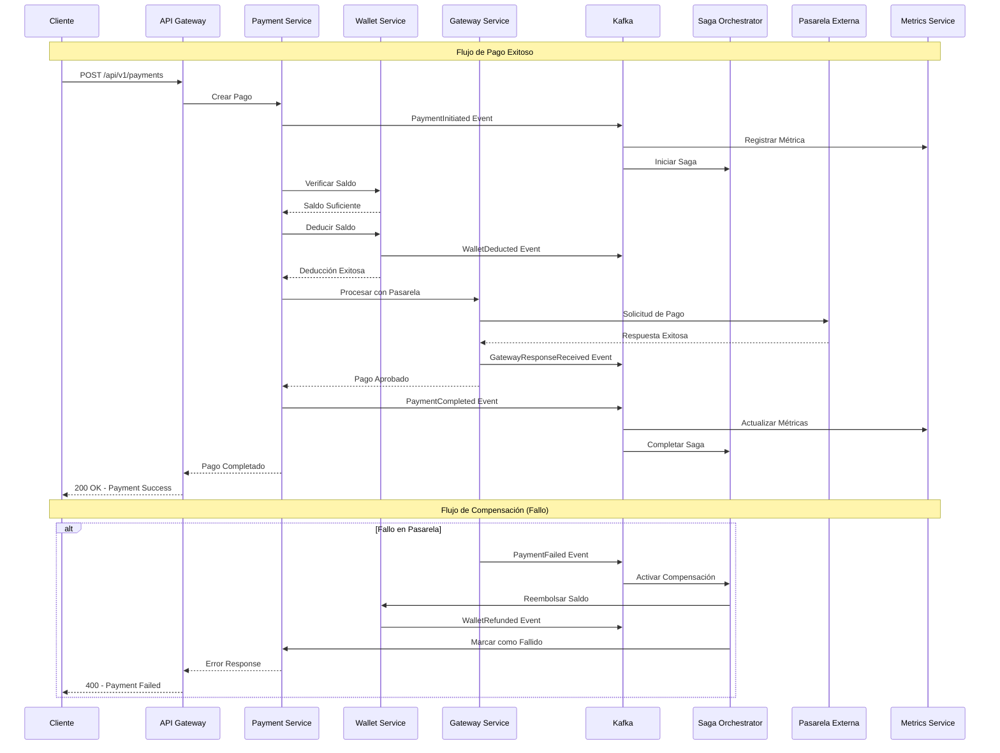
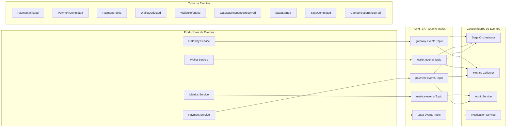
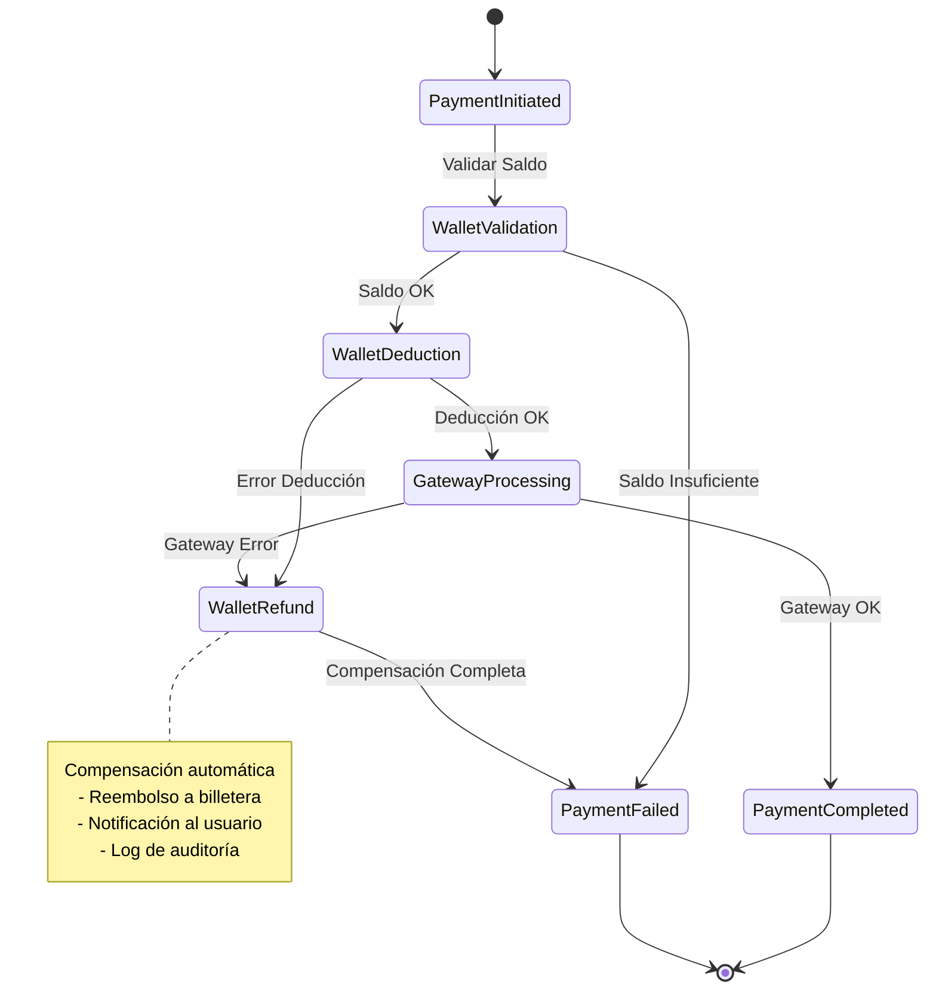
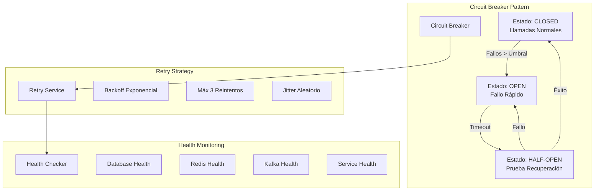
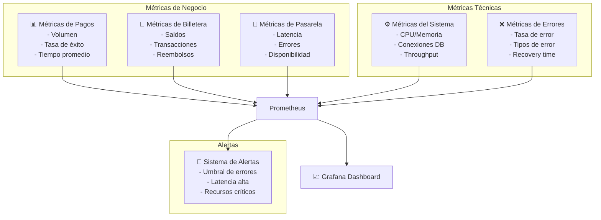

# Diagrama de Arquitectura del Sistema de Pagos

## Arquitectura General del Sistema

## Flujo de Procesamiento de Pagos

## Arquitectura de Eventos

## Patrón Saga - Manejo de Transacciones Distribuidas

## Componentes de Resiliencia

## Métricas y Observabilidad

