# Diagrama de Arquitectura del Sistema de Pagos

## Arquitectura General del Sistema

```mermaid
graph TB
    %% External Systems
    subgraph "Sistemas Externos"
        Gateway[🏦 Pasarela de Pago<br/>Stripe/PayPal]
        Client[👤 Cliente/API Consumer]
        Monitor[📊 Grafana Dashboard]
    end

    %% API Layer
    subgraph "Capa de API"
        LB[⚖️ Load Balancer]
        API[🌐 API Gateway<br/>Gin Router]
        Health[🏥 Health Checks<br/>/health, /ready, /live]
    end

    %% Core Services
    subgraph "Servicios Principales"
        PaymentSvc[💳 Payment Service<br/>Orquestador Principal]
        WalletSvc[👛 Wallet Service<br/>Gestión Billeteras]
        GatewaySvc[🔗 Gateway Service<br/>Circuit Breaker]
        MetricsSvc[📈 Metrics Service<br/>Prometheus]
        SagaOrch[🔄 Saga Orchestrator<br/>Transacciones Distribuidas]
    end

    %% Event Infrastructure
    subgraph "Infraestructura de Eventos"
        EventBus[📨 Apache Kafka<br/>Event Bus]
        Publisher[📤 Event Publisher]
        Subscriber[📥 Event Subscriber]
    end

    %% Data Layer
    subgraph "Capa de Datos"
        PostgresMain[(🐘 PostgreSQL<br/>Base Principal)]
        Redis[(🔴 Redis<br/>Cache & Sessions)]
        EventStore[(📚 Event Store<br/>Auditoría)]
    end

    %% Monitoring & Observability
    subgraph "Monitoreo y Observabilidad"
        Prometheus[📊 Prometheus<br/>Métricas]
        Logs[📝 Structured Logs<br/>Zap Logger]
        Tracing[🔍 OpenTelemetry<br/>Distributed Tracing]
    end

    %% External Connections
    Client --> LB
    LB --> API
    API --> Health
    
    %% API to Services
    API --> PaymentSvc
    API --> WalletSvc
    API --> MetricsSvc
    API --> SagaOrch

    %% Service Interactions
    PaymentSvc --> WalletSvc
    PaymentSvc --> GatewaySvc
    PaymentSvc --> Publisher
    
    WalletSvc --> Publisher
    GatewaySvc --> Gateway
    GatewaySvc --> Publisher
    
    MetricsSvc --> Publisher
    MetricsSvc --> Prometheus
    
    SagaOrch --> Publisher
    SagaOrch --> Subscriber

    %% Event Flow
    Publisher --> EventBus
    EventBus --> Subscriber
    Subscriber --> PaymentSvc
    Subscriber --> WalletSvc
    Subscriber --> MetricsSvc
    Subscriber --> SagaOrch

    %% Data Connections
    PaymentSvc --> PostgresMain
    WalletSvc --> PostgresMain
    MetricsSvc --> PostgresMain
    SagaOrch --> PostgresMain
    
    PaymentSvc --> Redis
    WalletSvc --> Redis
    GatewaySvc --> Redis
    
    Publisher --> EventStore
    
    %% Monitoring Connections
    PaymentSvc --> Logs
    WalletSvc --> Logs
    GatewaySvc --> Logs
    MetricsSvc --> Logs
    SagaOrch --> Logs
    
    Prometheus --> Monitor
    Logs --> Monitor
    Tracing --> Monitor

    %% Styling
    classDef external fill:#e1f5fe
    classDef api fill:#f3e5f5
    classDef service fill:#e8f5e8
    classDef event fill:#fff3e0
    classDef data fill:#fce4ec
    classDef monitor fill:#f1f8e9

    class Gateway,Client,Monitor external
    class LB,API,Health api
    class PaymentSvc,WalletSvc,GatewaySvc,MetricsSvc,SagaOrch service
    class EventBus,Publisher,Subscriber event
    class PostgresMain,Redis,EventStore data
    class Prometheus,Logs,Tracing monitor
```

## Flujo de Procesamiento de Pagos

```mermaid
sequenceDiagram
    participant C as Cliente
    participant API as API Gateway
    participant PS as Payment Service
    participant WS as Wallet Service
    participant GS as Gateway Service
    participant K as Kafka
    participant SO as Saga Orchestrator
    participant PG as Pasarela Externa
    participant MS as Metrics Service

    Note over C,MS: Flujo de Pago Exitoso

    C->>API: POST /api/v1/payments
    API->>PS: Crear Pago
    
    PS->>K: PaymentInitiated Event
    K->>MS: Registrar Métrica
    K->>SO: Iniciar Saga
    
    PS->>WS: Verificar Saldo
    WS-->>PS: Saldo Suficiente
    
    PS->>WS: Deducir Saldo
    WS->>K: WalletDeducted Event
    WS-->>PS: Deducción Exitosa
    
    PS->>GS: Procesar con Pasarela
    GS->>PG: Solicitud de Pago
    PG-->>GS: Respuesta Exitosa
    GS->>K: GatewayResponseReceived Event
    GS-->>PS: Pago Aprobado
    
    PS->>K: PaymentCompleted Event
    K->>MS: Actualizar Métricas
    K->>SO: Completar Saga
    
    PS-->>API: Pago Completado
    API-->>C: 200 OK - Payment Success

    Note over C,MS: Flujo de Compensación (Fallo)

    alt Fallo en Pasarela
        GS->>K: PaymentFailed Event
        K->>SO: Activar Compensación
        SO->>WS: Reembolsar Saldo
        WS->>K: WalletRefunded Event
        SO->>PS: Marcar como Fallido
        PS-->>API: Error Response
        API-->>C: 400 - Payment Failed
    end
```

## Arquitectura de Eventos

## Patrón Saga - Manejo de Transacciones Distribuidas

```mermaid
stateDiagram-v2
    [*] --> PaymentInitiated
    
    PaymentInitiated --> WalletValidation: Validar Saldo
    WalletValidation --> WalletDeduction: Saldo OK
    WalletValidation --> PaymentFailed: Saldo Insuficiente
    
    WalletDeduction --> GatewayProcessing: Deducción OK
    WalletDeduction --> WalletRefund: Error Deducción
    
    GatewayProcessing --> PaymentCompleted: Gateway OK
    GatewayProcessing --> WalletRefund: Gateway Error
    
    WalletRefund --> PaymentFailed: Compensación Completa
    PaymentCompleted --> [*]
    PaymentFailed --> [*]

    note right of WalletRefund
        Compensación automática
        - Reembolso a billetera
        - Notificación al usuario
        - Log de auditoría
    end note
```

## Componentes de Resiliencia

```mermaid
graph TB
    subgraph "Circuit Breaker Pattern"
        CB[Circuit Breaker]
        CBClosed[Estado: CLOSED<br/>Llamadas Normales]
        CBOpen[Estado: OPEN<br/>Fallo Rápido]
        CBHalf[Estado: HALF-OPEN<br/>Prueba Recuperación]
        
        CBClosed -->|Fallos > Umbral| CBOpen
        CBOpen -->|Timeout| CBHalf
        CBHalf -->|Éxito| CBClosed
        CBHalf -->|Fallo| CBOpen
    end

    subgraph "Retry Strategy"
        RS[Retry Service]
        Exponential[Backoff Exponencial]
        MaxRetries[Máx 3 Reintentos]
        Jitter[Jitter Aleatorio]
    end

    subgraph "Health Monitoring"
        HC[Health Checker]
        DBHealth[Database Health]
        RedisHealth[Redis Health]
        KafkaHealth[Kafka Health]
        ServiceHealth[Service Health]
    end

    CB --> RS
    RS --> HC
```

## Métricas y Observabilidad

```mermaid
graph TB
    subgraph "Métricas de Negocio"
        PaymentMetrics[📊 Métricas de Pagos<br/>- Volumen<br/>- Tasa de éxito<br/>- Tiempo promedio]
        WalletMetrics[👛 Métricas de Billetera<br/>- Saldos<br/>- Transacciones<br/>- Reembolsos]
        GatewayMetrics[🔗 Métricas de Pasarela<br/>- Latencia<br/>- Errores<br/>- Disponibilidad]
    end

    subgraph "Métricas Técnicas"
        SystemMetrics[⚙️ Métricas del Sistema<br/>- CPU/Memoria<br/>- Conexiones DB<br/>- Throughput]
        ErrorMetrics[❌ Métricas de Errores<br/>- Tasa de error<br/>- Tipos de error<br/>- Recovery time]
    end

    subgraph "Alertas"
        Alerts[🚨 Sistema de Alertas<br/>- Umbral de errores<br/>- Latencia alta<br/>- Recursos críticos]
    end

    PaymentMetrics --> Prometheus
    WalletMetrics --> Prometheus
    GatewayMetrics --> Prometheus
    SystemMetrics --> Prometheus
    ErrorMetrics --> Prometheus
    
    Prometheus --> Alerts
    Prometheus --> Grafana[📈 Grafana Dashboard]
```

