# Escenario 4 - Pagos Concurrentes: Control de Condiciones de Carrera

## Diagrama de Secuencia - Pagos Simultáneos con Consistencia

```mermaid
sequenceDiagram
    participant U1 as Usuario A
    participant U2 as Usuario B
    participant API as API Gateway
    participant PS as Payment Service
    participant WS as Wallet Service
    participant K as Kafka Event Bus
    participant SO as Saga Orchestrator
    participant MS as Metrics Service
    participant NS as Notification Service
    participant DB as PostgreSQL
    participant R as Redis Cache

    Note over U1,R: 🔄 ESCENARIO: PAGOS CONCURRENTES - MISMO USUARIO

    %% Configuración inicial
    Note over DB: Saldo inicial billetera: $1000
    Note over K: Partición Kafka por user_id garantiza orden

    %% 1. Solicitudes simultáneas
    par Pago A ($800)
        U1->>+API: POST /api/v1/payments<br/>{amount: 800, user_id: "user123"}
        API->>+PS: CreatePayment Request A
        PS->>DB: INSERT payment_a (status: INITIATED)
        PS->>+K: Publish PaymentInitiated A
        Note right of K: PaymentInitiated A<br/>{payment_id: "pay_A", user_id: "user123",<br/>amount: 800, partition_key: "user123"}
    and Pago B ($600)
        U2->>+API: POST /api/v1/payments<br/>{amount: 600, user_id: "user123"}
        API->>+PS: CreatePayment Request B
        PS->>DB: INSERT payment_b (status: INITIATED)
        PS->>+K: Publish PaymentInitiated B
        Note right of K: PaymentInitiated B<br/>{payment_id: "pay_B", user_id: "user123",<br/>amount: 600, partition_key: "user123"}
    end

    %% 2. Kafka garantiza orden por partición
    Note over K: Kafka Consumer Group procesa eventos<br/>SECUENCIALMENTE por partition_key
    
    %% 3. Procesamiento del Pago A (primero en llegar)
    K->>+SO: PaymentInitiated A (procesado PRIMERO)
    SO->>+WS: CheckWalletBalance Command A
    
    %% Bloqueo optimista con versioning
    WS->>DB: SELECT balance, version FROM wallets<br/>WHERE user_id = 'user123' FOR UPDATE
    Note over DB: 🔒 ROW LOCK adquirido<br/>balance: $1000, version: 1
    
    WS->>+K: Publish WalletBalanceChecked A
    Note right of K: WalletBalanceChecked A<br/>{sufficient_funds: true, available: 1000}
    
    K->>SO: WalletBalanceChecked A (sufficient)
    SO->>+WS: DeductWalletBalance Command A
    
    %% Deducción atómica con control de versión
    WS->>DB: BEGIN TRANSACTION
    WS->>DB: UPDATE wallets SET<br/>balance = 200, version = 2<br/>WHERE user_id = 'user123' AND version = 1
    WS->>DB: INSERT INTO transactions<br/>(payment_id: 'pay_A', type: 'debit', amount: 800)
    WS->>DB: COMMIT TRANSACTION
    Note over DB: ✅ Saldo actualizado: $200<br/>Version: 2, Lock liberado
    
    WS->>R: Invalidar cache para user123
    WS->>+K: Publish WalletDeducted A
    Note right of K: WalletDeducted A<br/>{payment_id: "pay_A", new_balance: 200}

    %% 4. Procesamiento del Pago B (segundo en cola)
    K->>+SO: PaymentInitiated B (procesado SEGUNDO)
    SO->>+WS: CheckWalletBalance Command B
    
    %% Intento de bloqueo - saldo ya actualizado
    WS->>DB: SELECT balance, version FROM wallets<br/>WHERE user_id = 'user123' FOR UPDATE
    Note over DB: 🔒 ROW LOCK adquirido<br/>balance: $200, version: 2 (actualizado)
    
    WS->>+K: Publish WalletBalanceChecked B
    Note right of K: WalletBalanceChecked B<br/>{sufficient_funds: false, available: 200,<br/>requested: 600, deficit: 400}
    
    %% 5. Rechazo del Pago B por fondos insuficientes
    K->>SO: WalletBalanceChecked B (insufficient)
    SO->>+PS: RejectPayment Command B
    PS->>DB: UPDATE payments SET status = 'FAILED',<br/>error_code = 'INSUFFICIENT_FUNDS'<br/>WHERE id = 'pay_B'
    PS->>+K: Publish PaymentFailed B
    Note right of K: PaymentFailed B<br/>{payment_id: "pay_B", reason: "INSUFFICIENT_FUNDS",<br/>available_balance: 200}

    %% 6. Continuación exitosa del Pago A
    K->>SO: WalletDeducted A
    SO->>+PS: ProcessWithGateway Command A
    PS->>+K: Publish GatewayRequestSent A
    
    Note over PS: Simulación de procesamiento exitoso
    PS->>+K: Publish GatewayResponseReceived A
    Note right of K: GatewayResponseReceived A<br/>{status: "success"}
    
    K->>SO: GatewayResponseReceived A
    SO->>+PS: ConfirmPayment Command A
    PS->>DB: UPDATE payments SET status = 'COMPLETED'
    PS->>+K: Publish PaymentCompleted A
    
    %% 7. Finalización de ambas sagas
    par Saga A - Completada
        K->>SO: PaymentCompleted A
        SO->>DB: UPDATE saga_a SET status = 'COMPLETED'
        SO->>+K: Publish SagaCompleted A
    and Saga B - Fallida
        K->>SO: PaymentFailed B
        SO->>DB: UPDATE saga_b SET status = 'FAILED'
        SO->>+K: Publish SagaFailed B
    end

    %% 8. Métricas diferenciadas
    par Métricas Pago A
        K->>+MS: PaymentCompleted A
        MS->>R: Incrementar successful_payments
        MS->>R: Registrar processing_time_A
    and Métricas Pago B
        K->>+MS: PaymentFailed B
        MS->>R: Incrementar failed_payments
        MS->>R: Incrementar insufficient_funds_rejections
    end

    %% 9. Notificaciones diferenciadas
    par Notificación A - Éxito
        K->>+NS: PaymentCompleted A
        NS->>U1: ✅ "Pago de $800 completado exitosamente"
        PS-->>-API: PaymentResponse A<br/>{status: "COMPLETED"}
        API-->>-U1: 200 OK
    and Notificación B - Rechazo
        K->>+NS: PaymentFailed B
        NS->>U2: ❌ "Pago de $600 rechazado<br/>Saldo insuficiente (disponible: $200)"
        PS-->>-API: PaymentErrorResponse B<br/>{error: "INSUFFICIENT_FUNDS"}
        API-->>-U2: 400 Bad Request
    end

    Note over U1,R: ✅ PAGO A: EXITOSO | ❌ PAGO B: RECHAZADO

    %% Desactivaciones
    deactivate K
    deactivate SO
    deactivate WS
    deactivate PS
    deactivate MS
    deactivate NS
```



## Mecanismos de Control de Concurrencia

### 1. Particionado por Usuario en Kafka
```yaml
Kafka_Partitioning:
  partition_key: user_id
  guarantee: "Eventos del mismo usuario procesados secuencialmente"
  consumer_group: "wallet-service-consumers"
  partitions: 12  # Escalabilidad para múltiples usuarios
  
Topic_Configuration:
  payment-events:
    partitions: 12
    replication_factor: 3
    partition_strategy: "hash(user_id)"
```

### 2. Bloqueo Optimista con Versionado
```sql
-- Estructura de tabla con control de versión
CREATE TABLE wallets (
    id UUID PRIMARY KEY,
    user_id VARCHAR(255) UNIQUE NOT NULL,
    balance DECIMAL(15,2) NOT NULL DEFAULT 0,
    currency VARCHAR(3) NOT NULL DEFAULT 'USD',
    version INTEGER NOT NULL DEFAULT 1,  -- Control optimista
    created_at TIMESTAMP DEFAULT NOW(),
    updated_at TIMESTAMP DEFAULT NOW()
);

-- Índice para bloqueo eficiente
CREATE INDEX idx_wallets_user_id ON wallets(user_id);
```

### 3. Transacción Atómica con Row Locking
```sql
-- Operación atómica de deducción
BEGIN;

-- Bloqueo exclusivo de la fila
SELECT balance, version 
FROM wallets 
WHERE user_id = $1 
FOR UPDATE;

-- Verificación de fondos suficientes
IF balance >= requested_amount THEN
    -- Actualización con control de versión
    UPDATE wallets 
    SET balance = balance - $2,
        version = version + 1,
        updated_at = NOW()
    WHERE user_id = $1 AND version = $3;
    
    -- Registro de transacción
    INSERT INTO transactions (
        wallet_id, payment_id, type, amount, 
        currency, status, created_at
    ) VALUES (
        wallet_id, $4, 'debit', $2, 
        'USD', 'completed', NOW()
    );
    
    COMMIT;
ELSE
    ROLLBACK;
    -- Emitir evento de fondos insuficientes
END IF;
```

## Estados de Concurrencia

### Timeline de Procesamiento
```
T0: Pago A y B iniciados simultáneamente
T1: Eventos en Kafka (misma partición por user_id)
T2: Pago A procesado primero (orden garantizado)
T3: Wallet locked para Pago A
T4: Deducción exitosa Pago A ($1000 → $200)
T5: Lock liberado, Pago B procesado
T6: Wallet locked para Pago B
T7: Verificación falla (saldo: $200 < $600)
T8: Pago B rechazado, Lock liberado
T9: Pago A continúa con gateway
T10: Notificaciones diferenciadas
```

### Estados de los Pagos
```yaml
Pago_A_Timeline:
  - INITIATED (T0)
  - WALLET_BALANCE_CHECKED (T2)
  - WALLET_DEDUCTED (T4)
  - GATEWAY_PROCESSING (T9)
  - COMPLETED (T10)

Pago_B_Timeline:
  - INITIATED (T0)
  - WALLET_BALANCE_CHECKED (T5)
  - FAILED_INSUFFICIENT_FUNDS (T7)
```

## Eventos Específicos de Concurrencia

### 1. WalletBalanceChecked (Concurrente)
```yaml
Productor: Wallet Service
Schema:
  payment_id: UUID
  user_id: string
  requested_amount: decimal
  available_balance: decimal  # Balance actual al momento del check
  sufficient_funds: boolean
  wallet_version: integer     # Versión para control optimista
  checked_at: timestamp
  processing_order: integer   # Orden de procesamiento
```

### 2. ConcurrentPaymentDetected
```yaml
Productor: Wallet Service
Consumidores: [Metrics Service, Alert Service]
Propósito: Registra detección de pagos concurrentes
Schema:
  user_id: string
  concurrent_payments: array[UUID]
  time_window_ms: integer
  resolution_strategy: "sequential_processing"
  detected_at: timestamp
```

### 3. PaymentFailed (Concurrencia)
```yaml
Productor: Payment Service
Schema:
  payment_id: UUID
  user_id: string
  failure_reason: "INSUFFICIENT_FUNDS_CONCURRENT"
  concurrent_payment_id: UUID  # ID del pago que "ganó"
  available_balance: decimal
  requested_amount: decimal
  deficit_amount: decimal
  failed_at: timestamp
```

## Configuración del Wallet Service

### Consumer Configuration
```yaml
Kafka_Consumer:
  group_id: "wallet-service-group"
  auto_offset_reset: "earliest"
  enable_auto_commit: false
  max_poll_records: 1  # Procesamiento secuencial estricto
  session_timeout_ms: 30000
  
Concurrency_Control:
  max_concurrent_operations_per_user: 1
  wallet_lock_timeout_ms: 5000
  version_conflict_retry_attempts: 3
  retry_backoff_ms: 100
```

### Database Connection Pool
```yaml
Database_Pool:
  max_connections: 20
  idle_timeout: 300s
  connection_timeout: 5s
  transaction_isolation: "READ_COMMITTED"
  lock_timeout: 5s
```

## Métricas de Concurrencia

### Métricas Específicas
```yaml
Concurrency_Metrics:
  - concurrent_payment_attempts_total
  - wallet_lock_contention_duration_seconds
  - version_conflict_retries_total
  - sequential_processing_queue_depth
  - insufficient_funds_due_to_concurrency_total
```

### Alertas de Concurrencia
```yaml
Alerts:
  - name: "High Concurrent Payment Rate"
    condition: "concurrent_payment_attempts > 100/min"
    severity: "warning"
  
  - name: "Wallet Lock Contention"
    condition: "avg(wallet_lock_duration) > 1s"
    severity: "critical"
```

## Implementación del Wallet Service

### Concurrent Payment Handler
```go
func (ws *WalletService) ProcessPaymentConcurrently(ctx context.Context, payment Payment) error {
    // Acquire distributed lock per user
    lockKey := fmt.Sprintf("wallet_lock:%s", payment.UserID)
    lock, err := ws.redis.AcquireLock(ctx, lockKey, 5*time.Second)
    if err != nil {
        return fmt.Errorf("failed to acquire wallet lock: %w", err)
    }
    defer lock.Release()

    // Begin database transaction with row locking
    tx, err := ws.db.BeginTx(ctx, &sql.TxOptions{
        Isolation: sql.LevelReadCommitted,
    })
    if err != nil {
        return err
    }
    defer tx.Rollback()

    // Select with row lock and version check
    var wallet Wallet
    err = tx.QueryRowContext(ctx, `
        SELECT id, user_id, balance, version 
        FROM wallets 
        WHERE user_id = $1 
        FOR UPDATE
    `, payment.UserID).Scan(&wallet.ID, &wallet.UserID, &wallet.Balance, &wallet.Version)
    
    if err != nil {
        return err
    }

    // Check sufficient funds
    if wallet.Balance < payment.Amount {
        ws.publishInsufficientFundsEvent(payment, wallet.Balance)
        return ErrInsufficientFunds
    }

    // Atomic deduction with version increment
    _, err = tx.ExecContext(ctx, `
        UPDATE wallets 
        SET balance = balance - $1, 
            version = version + 1,
            updated_at = NOW()
        WHERE user_id = $2 AND version = $3
    `, payment.Amount, payment.UserID, wallet.Version)
    
    if err != nil {
        return err
    }

    // Record transaction
    _, err = tx.ExecContext(ctx, `
        INSERT INTO transactions (wallet_id, payment_id, type, amount, currency, status)
        VALUES ($1, $2, 'debit', $3, $4, 'completed')
    `, wallet.ID, payment.ID, payment.Amount, payment.Currency)
    
    if err != nil {
        return err
    }

    // Commit transaction
    if err = tx.Commit(); err != nil {
        return err
    }

    // Publish success event
    ws.publishWalletDeductedEvent(payment, wallet.Balance-payment.Amount)
    return nil
}
```

## Ventajas del Diseño

### Garantías de Consistencia
- **Atomicidad**: Transacciones ACID garantizan consistencia
- **Aislamiento**: Row locking previene condiciones de carrera
- **Orden**: Kafka partitioning garantiza procesamiento secuencial
- **Versionado**: Control optimista detecta conflictos

### Performance Optimizada
- **Lock granular**: Solo por usuario, no global
- **Procesamiento paralelo**: Usuarios diferentes en paralelo
- **Fallo rápido**: Detección temprana de fondos insuficientes
- **Cache invalidation**: Solo para usuario afectado

### Observabilidad Completa
- **Métricas detalladas**: Contención, conflictos, tiempos
- **Trazabilidad**: Orden de procesamiento registrado
- **Alertas proactivas**: Detección de patrones anómalos

Este diseño garantiza **consistencia absoluta** en pagos concurrentes mientras mantiene **alta performance** y **observabilidad completa**.
