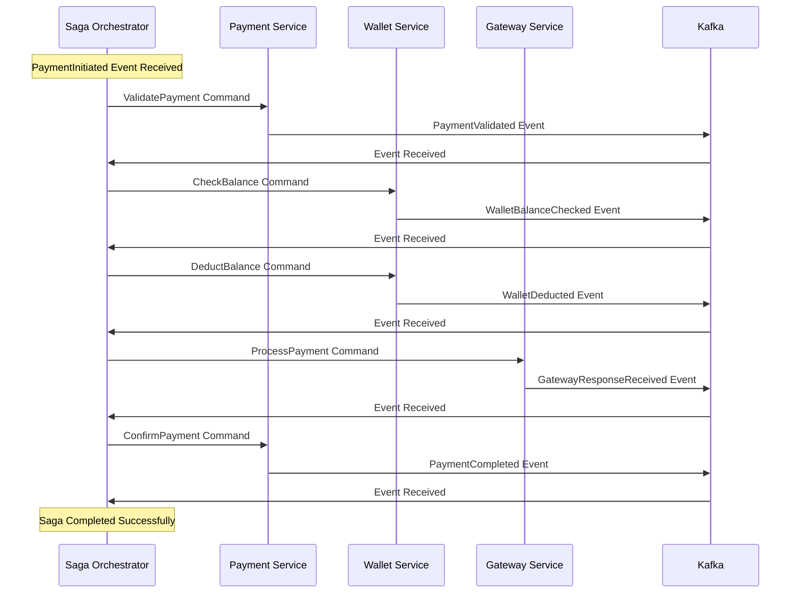
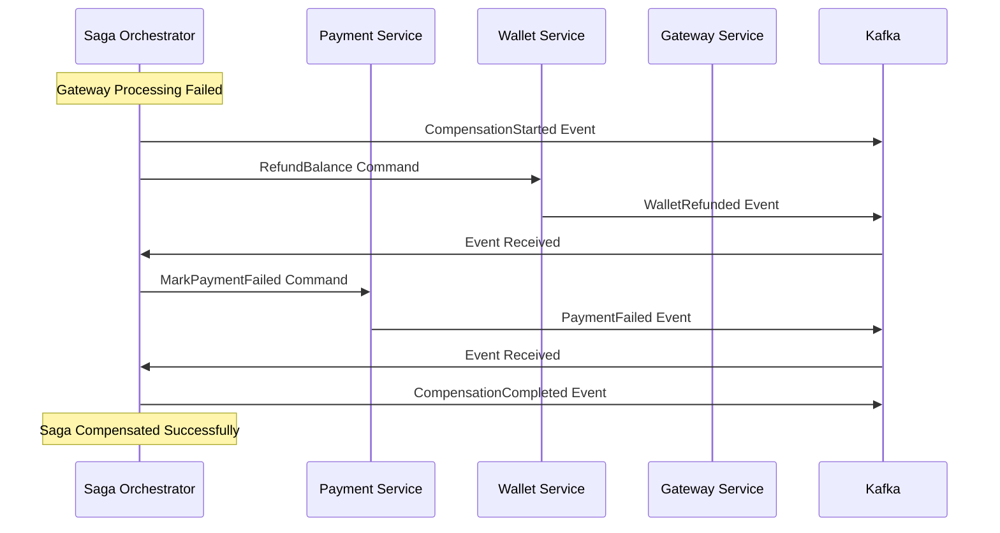

# Especificación de Arquitectura Orientada a Eventos

## Índice
1. [Catálogo de Eventos](#catálogo-de-eventos)
2. [Estructura de Tópicos y Colas](#estructura-de-tópicos-y-colas)
3. [Garantías de Entrega](#garantías-de-entrega)
4. [Event Sourcing](#event-sourcing)
5. [Patrón Saga](#patrón-saga)
6. [Configuración de Kafka](#configuración-de-kafka)

---

## Catálogo de Eventos

### Eventos de Dominio de Pagos

#### PaymentInitiated
```yaml
Propósito: Señala el inicio de un proceso de pago
Contexto: Payment Domain
Trigger: Cliente solicita nuevo pago
Schema:
  aggregate_id: string (UUID del pago)
  user_id: string
  amount: decimal(10,2)
  currency: string (ISO 4217)
  payment_method: enum [WALLET, CARD, BANK_TRANSFER]
  merchant_id: string
  description: string
  metadata: object
  initiated_at: timestamp (ISO 8601)
Productores: [Payment Service]
Consumidores: [Saga Orchestrator, Metrics Service, Audit Service]
```

#### PaymentValidated
```yaml
Propósito: Confirma que el pago ha pasado todas las validaciones
Contexto: Payment Domain
Trigger: Validaciones de negocio completadas exitosamente
Schema:
  aggregate_id: string
  user_id: string
  validation_checks: array[string]
  validated_at: timestamp
Productores: [Payment Service]
Consumidores: [Saga Orchestrator]
```

#### PaymentCompleted
```yaml
Propósito: Indica finalización exitosa del proceso de pago
Contexto: Payment Domain
Trigger: Confirmación de pasarela externa recibida
Schema:
  aggregate_id: string
  user_id: string
  amount: decimal(10,2)
  currency: string
  gateway_transaction_id: string
  gateway_provider: string
  processing_time_ms: integer
  completed_at: timestamp
Productores: [Payment Service]
Consumidores: [Saga Orchestrator, Metrics Service, Notification Service, Audit Service]
```

#### PaymentFailed
```yaml
Propósito: Notifica fallo en el procesamiento del pago
Contexto: Payment Domain
Trigger: Error en cualquier etapa del proceso
Schema:
  aggregate_id: string
  user_id: string
  failure_stage: enum [VALIDATION, WALLET_DEDUCTION, GATEWAY_PROCESSING]
  error_code: string
  error_message: string
  retry_count: integer
  failed_at: timestamp
Productores: [Payment Service, Gateway Service]
Consumidores: [Saga Orchestrator, Metrics Service, Alert Service]
```

#### PaymentCancelled
```yaml
Propósito: Indica cancelación manual o automática del pago
Contexto: Payment Domain
Trigger: Cancelación por usuario, timeout o reglas de negocio
Schema:
  aggregate_id: string
  user_id: string
  cancelled_by: enum [USER, SYSTEM, ADMIN]
  cancellation_reason: string
  cancelled_at: timestamp
Productores: [Payment Service]
Consumidores: [Saga Orchestrator, Wallet Service, Metrics Service]
```

### Eventos de Dominio de Billetera

#### WalletBalanceChecked
```yaml
Propósito: Resultado de verificación de saldo disponible
Contexto: Wallet Domain
Trigger: Solicitud de verificación de fondos
Schema:
  wallet_id: string (UUID)
  user_id: string
  currency: string
  requested_amount: decimal(10,2)
  available_balance: decimal(10,2)
  sufficient_funds: boolean
  checked_at: timestamp
Productores: [Wallet Service]
Consumidores: [Payment Service, Saga Orchestrator]
```

#### WalletDeducted
```yaml
Propósito: Confirma deducción exitosa de fondos
Contexto: Wallet Domain
Trigger: Deducción de saldo completada
Schema:
  wallet_id: string
  user_id: string
  transaction_id: string (UUID)
  amount: decimal(10,2)
  currency: string
  previous_balance: decimal(10,2)
  new_balance: decimal(10,2)
  reference_id: string (ID del pago)
  deducted_at: timestamp
Productores: [Wallet Service]
Consumidores: [Payment Service, Saga Orchestrator, Metrics Service, Audit Service]
```

#### WalletDeductionFailed
```yaml
Propósito: Notifica fallo en deducción de fondos
Contexto: Wallet Domain
Trigger: Error durante deducción (fondos insuficientes, bloqueo, etc.)
Schema:
  wallet_id: string
  user_id: string
  requested_amount: decimal(10,2)
  current_balance: decimal(10,2)
  failure_reason: enum [INSUFFICIENT_FUNDS, WALLET_LOCKED, CURRENCY_MISMATCH]
  error_details: string
  failed_at: timestamp
Productores: [Wallet Service]
Consumidores: [Payment Service, Saga Orchestrator, Metrics Service]
```

#### WalletRefunded
```yaml
Propósito: Confirma reembolso exitoso a billetera
Contexto: Wallet Domain
Trigger: Proceso de compensación o reembolso manual
Schema:
  wallet_id: string
  user_id: string
  transaction_id: string (UUID)
  amount: decimal(10,2)
  currency: string
  previous_balance: decimal(10,2)
  new_balance: decimal(10,2)
  refund_reason: string
  original_transaction_id: string
  refunded_at: timestamp
Productores: [Wallet Service]
Consumidores: [Saga Orchestrator, Metrics Service, Notification Service, Audit Service]
```

#### WalletLocked
```yaml
Propósito: Indica bloqueo temporal de billetera
Contexto: Wallet Domain
Trigger: Actividad sospechosa o mantenimiento
Schema:
  wallet_id: string
  user_id: string
  lock_reason: string
  locked_by: string
  estimated_unlock_time: timestamp
  locked_at: timestamp
Productores: [Wallet Service, Fraud Detection Service]
Consumidores: [Payment Service, Notification Service, Audit Service]
```

### Eventos de Dominio de Pasarela

#### GatewayRequestSent
```yaml
Propósito: Registra envío de solicitud a pasarela externa
Contexto: Gateway Domain
Trigger: Solicitud enviada a proveedor externo
Schema:
  payment_id: string
  gateway_provider: enum [STRIPE, PAYPAL, ADYEN]
  request_id: string
  amount: decimal(10,2)
  currency: string
  sent_at: timestamp
Productores: [Gateway Service]
Consumidores: [Metrics Service, Audit Service]
```

#### GatewayResponseReceived
```yaml
Propósito: Registra respuesta recibida de pasarela externa
Contexto: Gateway Domain
Trigger: Respuesta de proveedor externo recibida
Schema:
  payment_id: string
  gateway_provider: string
  gateway_transaction_id: string
  status: enum [SUCCESS, FAILED, PENDING]
  response_time_ms: integer
  response_code: string
  received_at: timestamp
Productores: [Gateway Service]
Consumidores: [Payment Service, Metrics Service, Audit Service]
```

#### CircuitBreakerOpened
```yaml
Propósito: Notifica apertura de circuit breaker
Contexto: Gateway Domain
Trigger: Umbral de fallos excedido
Schema:
  gateway_provider: string
  failure_count: integer
  failure_rate: decimal(5,2)
  opened_at: timestamp
  estimated_recovery_time: timestamp
Productores: [Gateway Service]
Consumidores: [Metrics Service, Alert Service, Operations Dashboard]
```

#### CircuitBreakerClosed
```yaml
Propósito: Notifica cierre de circuit breaker
Contexto: Gateway Domain
Trigger: Recuperación exitosa del servicio
Schema:
  gateway_provider: string
  downtime_duration_ms: integer
  closed_at: timestamp
Productores: [Gateway Service]
Consumidores: [Metrics Service, Alert Service]
```

### Eventos de Dominio de Métricas

#### MetricRecorded
```yaml
Propósito: Registra nueva métrica del sistema
Contexto: Metrics Domain
Trigger: Cualquier evento medible del sistema
Schema:
  metric_name: string
  metric_type: enum [COUNTER, GAUGE, HISTOGRAM, SUMMARY]
  value: decimal
  labels: object
  recorded_at: timestamp
Productores: [Metrics Service]
Consumidores: [Prometheus Exporter, Alert Service]
```

#### AlertTriggered
```yaml
Propósito: Notifica activación de alerta
Contexto: Metrics Domain
Trigger: Métrica excede umbral configurado
Schema:
  alert_id: string (UUID)
  alert_name: string
  severity: enum [LOW, MEDIUM, HIGH, CRITICAL]
  metric_name: string
  current_value: decimal
  threshold_value: decimal
  alert_rule: string
  triggered_at: timestamp
Productores: [Metrics Service]
Consumidores: [Notification Service, Operations Dashboard, PagerDuty]
```

### Eventos de Saga

#### SagaStarted
```yaml
Propósito: Inicia nueva saga de transacción distribuida
Contexto: Saga Domain
Trigger: Evento de dominio que requiere coordinación
Schema:
  saga_id: string (UUID)
  saga_type: enum [PAYMENT_PROCESSING, REFUND_PROCESSING]
  correlation_id: string
  initiating_event: string
  steps: array[object]
  timeout_duration_ms: integer
  started_at: timestamp
Productores: [Saga Orchestrator]
Consumidores: [Audit Service, Metrics Service]
```

#### SagaStepCompleted
```yaml
Propósito: Confirma finalización exitosa de paso de saga
Contexto: Saga Domain
Trigger: Paso individual de saga completado
Schema:
  saga_id: string
  step_name: string
  step_order: integer
  step_result: object
  completed_at: timestamp
Productores: [Saga Orchestrator]
Consumidores: [Audit Service]
```

#### SagaCompleted
```yaml
Propósito: Confirma finalización exitosa de saga completa
Contexto: Saga Domain
Trigger: Todos los pasos completados exitosamente
Schema:
  saga_id: string
  correlation_id: string
  total_steps: integer
  total_duration_ms: integer
  completed_at: timestamp
Productores: [Saga Orchestrator]
Consumidores: [Audit Service, Metrics Service]
```

#### CompensationStarted
```yaml
Propósito: Inicia proceso de compensación
Contexto: Saga Domain
Trigger: Fallo en paso de saga requiere rollback
Schema:
  saga_id: string
  failed_step: string
  compensation_steps: array[object]
  failure_reason: string
  started_at: timestamp
Productores: [Saga Orchestrator]
Consumidores: [Payment Service, Wallet Service, Audit Service]
```

#### CompensationCompleted
```yaml
Propósito: Confirma finalización de compensación
Contexto: Saga Domain
Trigger: Todos los pasos de compensación completados
Schema:
  saga_id: string
  compensated_steps: array[string]
  compensation_duration_ms: integer
  completed_at: timestamp
Productores: [Saga Orchestrator]
Consumidores: [Audit Service, Metrics Service]
```

---

## Estructura de Tópicos y Colas

### Convenciones de Nomenclatura

```
Patrón: {domain}.{entity}.{action}
Ejemplos:
- payment.transaction.initiated
- wallet.balance.deducted
- gateway.response.received
- saga.compensation.started
```

### Tópicos de Kafka

#### Tópicos por Dominio

```yaml
payment-events:
  partitions: 12
  replication_factor: 3
  retention_ms: 604800000  # 7 días
  cleanup_policy: delete
  eventos:
    - PaymentInitiated
    - PaymentValidated
    - PaymentCompleted
    - PaymentFailed
    - PaymentCancelled

wallet-events:
  partitions: 8
  replication_factor: 3
  retention_ms: 2592000000  # 30 días
  cleanup_policy: compact  # Para event sourcing
  eventos:
    - WalletBalanceChecked
    - WalletDeducted
    - WalletDeductionFailed
    - WalletRefunded
    - WalletLocked

gateway-events:
  partitions: 6
  replication_factor: 3
  retention_ms: 259200000  # 3 días
  cleanup_policy: delete
  eventos:
    - GatewayRequestSent
    - GatewayResponseReceived
    - CircuitBreakerOpened
    - CircuitBreakerClosed

metrics-events:
  partitions: 4
  replication_factor: 3
  retention_ms: 86400000  # 1 día
  cleanup_policy: delete
  eventos:
    - MetricRecorded
    - AlertTriggered

saga-events:
  partitions: 6
  replication_factor: 3
  retention_ms: 1209600000  # 14 días
  cleanup_policy: delete
  eventos:
    - SagaStarted
    - SagaStepCompleted
    - SagaCompleted
    - CompensationStarted
    - CompensationCompleted

audit-events:
  partitions: 4
  replication_factor: 3
  retention_ms: 31536000000  # 1 año
  cleanup_policy: compact
  eventos: [Todos los eventos para auditoría]
```

#### Estrategia de Particionamiento

```yaml
payment-events:
  partition_key: user_id
  rationale: "Garantiza orden por usuario"

wallet-events:
  partition_key: wallet_id
  rationale: "Garantiza orden por billetera para event sourcing"

gateway-events:
  partition_key: payment_id
  rationale: "Agrupa eventos relacionados al mismo pago"

saga-events:
  partition_key: saga_id
  rationale: "Mantiene orden de pasos de saga"
```

### Dead Letter Queues

```yaml
payment-dlq:
  purpose: "Eventos de pago que fallaron procesamiento"
  retention_ms: 2592000000  # 30 días
  max_retries: 3

wallet-dlq:
  purpose: "Eventos de billetera que fallaron procesamiento"
  retention_ms: 2592000000  # 30 días
  max_retries: 5  # Más crítico para consistencia

gateway-dlq:
  purpose: "Eventos de pasarela que fallaron procesamiento"
  retention_ms: 604800000  # 7 días
  max_retries: 3
```

---

## Garantías de Entrega

### At-Least-Once Delivery

**Implementación**:
```yaml
Producer_Config:
  acks: "all"  # Esperar confirmación de todas las réplicas
  retries: 2147483647  # Reintentos infinitos
  max_in_flight_requests_per_connection: 1  # Orden garantizado
  enable_idempotence: true  # Evitar duplicados

Consumer_Config:
  enable_auto_commit: false  # Commit manual
  isolation_level: "read_committed"  # Solo mensajes confirmados
```

**Manejo de Duplicados**:
```yaml
Idempotency_Strategy:
  method: "Event ID + Idempotency Key"
  implementation:
    - Cada evento tiene UUID único
    - Consumidores mantienen cache de eventos procesados
    - TTL de cache: 24 horas
    - Verificación antes de procesamiento
```

### Exactly-Once Semantics

**Para Operaciones Críticas** (Wallet Operations):
```yaml
Transactional_Outbox:
  implementation:
    - Evento y cambio de estado en misma transacción DB
    - Outbox table para eventos pendientes
    - Publisher separado lee outbox y publica
    - Marca eventos como publicados

Database_Transaction:
  isolation_level: "SERIALIZABLE"
  timeout: 30s
  retry_policy: "exponential_backoff"
```

### Orden de Eventos

**Garantías por Partición**:
```yaml
Ordering_Strategy:
  partition_level: "Orden garantizado dentro de partición"
  global_level: "No garantizado entre particiones"
  
Timestamp_Strategy:
  event_time: "Timestamp del evento de negocio"
  processing_time: "Timestamp de procesamiento"
  watermarks: "Para detectar eventos tardíos"
```

---

## Event Sourcing

### Implementación para Wallet Service

#### Event Store Schema

```sql
CREATE TABLE wallet_events (
    event_id UUID PRIMARY KEY,
    wallet_id UUID NOT NULL,
    event_type VARCHAR(100) NOT NULL,
    event_data JSONB NOT NULL,
    event_version INTEGER NOT NULL,
    occurred_at TIMESTAMP WITH TIME ZONE NOT NULL,
    created_at TIMESTAMP WITH TIME ZONE DEFAULT NOW()
);

CREATE INDEX idx_wallet_events_wallet_id_version 
ON wallet_events (wallet_id, event_version);

CREATE INDEX idx_wallet_events_occurred_at 
ON wallet_events (occurred_at);
```

#### Eventos de Wallet para Event Sourcing

```yaml
WalletCreated:
  schema:
    wallet_id: string
    user_id: string
    currency: string
    initial_balance: decimal(10,2)
    created_at: timestamp

BalanceDeducted:
  schema:
    wallet_id: string
    transaction_id: string
    amount: decimal(10,2)
    previous_balance: decimal(10,2)
    new_balance: decimal(10,2)
    reference_id: string
    deducted_at: timestamp

BalanceAdded:
  schema:
    wallet_id: string
    transaction_id: string
    amount: decimal(10,2)
    previous_balance: decimal(10,2)
    new_balance: decimal(10,2)
    source: enum [REFUND, TOP_UP, BONUS]
    added_at: timestamp

WalletFrozen:
  schema:
    wallet_id: string
    reason: string
    frozen_by: string
    frozen_at: timestamp

WalletUnfrozen:
  schema:
    wallet_id: string
    unfrozen_by: string
    unfrozen_at: timestamp
```

#### Reconstrucción de Estado

```go
type WalletAggregate struct {
    ID       string
    UserID   string
    Currency string
    Balance  decimal.Decimal
    Status   WalletStatus
    Version  int
    UpdatedAt time.Time
}

func (w *WalletAggregate) ApplyEvent(event Event) error {
    switch e := event.(type) {
    case WalletCreatedEvent:
        w.ID = e.WalletID
        w.UserID = e.UserID
        w.Currency = e.Currency
        w.Balance = e.InitialBalance
        w.Status = Active
        
    case BalanceDeductedEvent:
        w.Balance = e.NewBalance
        
    case BalanceAddedEvent:
        w.Balance = e.NewBalance
        
    case WalletFrozenEvent:
        w.Status = Frozen
        
    case WalletUnfrozenEvent:
        w.Status = Active
    }
    
    w.Version++
    w.UpdatedAt = event.OccurredAt()
    return nil
}
```

#### Snapshots para Performance

```yaml
Snapshot_Strategy:
  frequency: "Cada 100 eventos"
  storage: "Tabla separada wallet_snapshots"
  compression: "gzip"
  retention: "Mantener últimos 10 snapshots"

Snapshot_Schema:
  snapshot_id: UUID
  wallet_id: UUID
  snapshot_data: JSONB (estado completo)
  event_version: INTEGER (versión del último evento)
  created_at: TIMESTAMP
```

#### Replay de Eventos

```go
func (r *WalletRepository) ReplayEvents(walletID string, fromVersion int) (*WalletAggregate, error) {
    // 1. Buscar snapshot más reciente antes de fromVersion
    snapshot, err := r.getLatestSnapshot(walletID, fromVersion)
    
    var wallet *WalletAggregate
    var startVersion int
    
    if snapshot != nil {
        wallet = snapshot.ToAggregate()
        startVersion = snapshot.EventVersion + 1
    } else {
        wallet = &WalletAggregate{}
        startVersion = 1
    }
    
    // 2. Aplicar eventos desde snapshot hasta versión actual
    events, err := r.getEvents(walletID, startVersion, fromVersion)
    if err != nil {
        return nil, err
    }
    
    for _, event := range events {
        if err := wallet.ApplyEvent(event); err != nil {
            return nil, err
        }
    }
    
    return wallet, nil
}
```

---

## Patrón Saga

### Saga de Procesamiento de Pagos

#### Definición de Saga

```yaml
PaymentProcessingSaga:
  steps:
    1. ValidatePayment
    2. CheckWalletBalance  
    3. DeductWalletBalance
    4. ProcessWithGateway
    5. ConfirmPayment
  
  compensations:
    5. CancelPaymentConfirmation
    4. RefundGatewayTransaction
    3. RefundWalletBalance
    2. [No compensation needed]
    1. [No compensation needed]
```

#### Implementación de Saga Orchestrator

```go
type PaymentSaga struct {
    ID            string
    PaymentID     string
    UserID        string
    Amount        decimal.Decimal
    Currency      string
    CurrentStep   int
    Status        SagaStatus
    Steps         []SagaStep
    Compensations []CompensationStep
    StartedAt     time.Time
    CompletedAt   *time.Time
}

type SagaStep struct {
    Name        string
    Status      StepStatus
    Command     Command
    Event       string
    CompletedAt *time.Time
    Error       *string
}
```

#### Flujo de Saga - Caso Exitoso



#### Flujo de Compensación



#### Estado de Saga en Base de Datos

```sql
CREATE TABLE sagas (
    saga_id UUID PRIMARY KEY,
    saga_type VARCHAR(50) NOT NULL,
    correlation_id VARCHAR(100) NOT NULL,
    status VARCHAR(20) NOT NULL,
    current_step INTEGER NOT NULL,
    saga_data JSONB NOT NULL,
    started_at TIMESTAMP WITH TIME ZONE NOT NULL,
    completed_at TIMESTAMP WITH TIME ZONE,
    updated_at TIMESTAMP WITH TIME ZONE DEFAULT NOW()
);

CREATE TABLE saga_steps (
    step_id UUID PRIMARY KEY,
    saga_id UUID REFERENCES sagas(saga_id),
    step_name VARCHAR(100) NOT NULL,
    step_order INTEGER NOT NULL,
    status VARCHAR(20) NOT NULL,
    command_data JSONB,
    result_data JSONB,
    error_message TEXT,
    started_at TIMESTAMP WITH TIME ZONE,
    completed_at TIMESTAMP WITH TIME ZONE
);
```

#### Manejo de Timeouts

```yaml
Timeout_Configuration:
  saga_timeout: 300s  # 5 minutos máximo por saga
  step_timeout: 60s   # 1 minuto máximo por paso
  
Timeout_Handling:
  strategy: "Compensación automática"
  implementation:
    - Timer por saga y por paso
    - Evento TimeoutExpired
    - Activación automática de compensación
    - Alertas para timeouts frecuentes
```

#### Recuperación ante Fallos

```yaml
Recovery_Strategy:
  persistence: "Estado de saga en PostgreSQL"
  checkpointing: "Después de cada paso completado"
  restart_behavior: "Continuar desde último checkpoint"
  
Failure_Scenarios:
  orchestrator_crash:
    recovery: "Recargar sagas activas al reiniciar"
    timeout: "Continuar con timeouts configurados"
    
  step_failure:
    retry_policy: "3 intentos con backoff exponencial"
    compensation: "Activar si todos los reintentos fallan"
    
  compensation_failure:
    escalation: "Alerta manual para intervención"
    logging: "Log detallado para debugging"
```

### Consideraciones de Consistencia

#### Consistencia Eventual
- Los servicios pueden estar temporalmente inconsistentes
- La saga garantiza consistencia eventual
- Timeouts y compensaciones manejan casos edge

#### Idempotencia
- Todos los comandos de saga son idempotentes
- Reintentos seguros sin efectos secundarios
- Verificación de estado antes de ejecutar acciones

#### Observabilidad
- Cada paso de saga genera eventos de auditoría
- Métricas de duración y tasa de éxito
- Dashboards para monitoreo de sagas activas
