# Escenario 3 - Timeout de Pasarela Externa: Flujo con Reintentos y Fallback

## Diagrama de Secuencia - Timeout y Reintentos de Pasarela

```mermaid
sequenceDiagram
    participant U as Usuario/Cliente
    participant API as API Gateway
    participant PS as Payment Service
    participant WS as Wallet Service
    participant GS as Gateway Service
    participant K as Kafka Event Bus
    participant SO as Saga Orchestrator
    participant MS as Metrics Service
    participant NS as Notification Service
    participant PG1 as Pasarela Principal<br/>(Stripe)
    participant PG2 as Pasarela Fallback<br/>(PayPal)
    participant DB as PostgreSQL
    participant R as Redis Cache

    Note over U,R: ⏰ ESCENARIO: TIMEOUT DE PASARELA CON REINTENTOS

    %% 1-6. Flujo inicial igual que ruta feliz hasta deducción
    U->>+API: POST /api/v1/payments<br/>{amount: 500, currency: "USD"}
    API->>+PS: CreatePayment Request
    PS->>DB: Crear pago (status: INITIATED)
    PS->>+K: Publish PaymentInitiated Event
    K->>+SO: PaymentInitiated Event
    SO->>+WS: CheckWalletBalance Command
    WS->>+K: Publish WalletBalanceChecked (sufficient_funds: true)
    K->>SO: WalletBalanceChecked Event
    SO->>+WS: DeductWalletBalance Command
    WS->>DB: Deducir saldo (transacción atómica)
    WS->>+K: Publish WalletDeducted Event
    
    %% 7. Procesamiento con Pasarela - PRIMER INTENTO
    K->>SO: WalletDeducted Event
    SO->>+GS: ProcessWithGateway Command<br/>{payment_id, amount, attempt: 1}
    GS->>DB: Marcar pago como GATEWAY_PROCESSING
    GS->>+K: Publish GatewayRequestSent Event
    Note right of K: GatewayRequestSent<br/>{payment_id, provider: "stripe", attempt: 1}
    
    GS->>+PG1: HTTP POST /charges<br/>{amount, currency} - Timeout: 30s
    Note over PG1: ⏰ TIMEOUT - Sin respuesta en 30s
    PG1-->>GS: ❌ Timeout Exception
    
    %% 8. Primer Reintento - Mismo Proveedor
    GS->>R: Verificar circuit breaker status
    GS->>+K: Publish GatewayTimeoutOccurred Event
    Note right of K: GatewayTimeoutOccurred<br/>{payment_id, provider: "stripe",<br/>attempt: 1, next_retry_in: "2s"}
    
    Note over GS: Esperar 2s (backoff exponencial)
    GS->>+PG1: HTTP POST /charges<br/>REINTENTO #1 - Timeout: 30s
    Note over PG1: ⏰ TIMEOUT AGAIN
    PG1-->>GS: ❌ Timeout Exception
    
    %% 9. Segundo Reintento - Mismo Proveedor
    GS->>+K: Publish GatewayTimeoutOccurred Event
    Note right of K: GatewayTimeoutOccurred<br/>{payment_id, provider: "stripe",<br/>attempt: 2, next_retry_in: "4s"}
    
    Note over GS: Esperar 4s (backoff exponencial)
    GS->>+PG1: HTTP POST /charges<br/>REINTENTO #2 - Timeout: 30s
    Note over PG1: ⏰ TIMEOUT AGAIN
    PG1-->>GS: ❌ Timeout Exception
    
    %% 10. Circuit Breaker se Abre - Fallback a Segunda Pasarela
    GS->>R: Abrir circuit breaker para Stripe
    GS->>+K: Publish CircuitBreakerOpened Event
    Note right of K: CircuitBreakerOpened<br/>{provider: "stripe", failure_count: 3}
    
    GS->>+K: Publish GatewayFallbackTriggered Event
    Note right of K: GatewayFallbackTriggered<br/>{payment_id, from: "stripe", to: "paypal"}
    
    %% 11. Intento con Pasarela Fallback
    GS->>+PG2: HTTP POST /payments<br/>{amount, currency} - Timeout: 30s
    Note over PG2: ✅ Respuesta exitosa
    PG2-->>-GS: 200 OK<br/>{transaction_id, status: "completed"}
    
    GS->>+K: Publish GatewayResponseReceived Event
    Note right of K: GatewayResponseReceived<br/>{payment_id, provider: "paypal",<br/>status: "success", attempt_total: 4}
    
    %% 12. Confirmación del Pago tras Fallback Exitoso
    K->>SO: GatewayResponseReceived Event (success)
    SO->>+PS: ConfirmPayment Command
    PS->>DB: UPDATE payments SET status = 'COMPLETED'
    PS->>+K: Publish PaymentCompleted Event
    Note right of K: PaymentCompleted<br/>{payment_id, gateway_provider: "paypal",<br/>total_attempts: 4, fallback_used: true}
    
    %% 13. Finalización de Saga
    K->>SO: PaymentCompleted Event
    SO->>DB: UPDATE saga SET status = 'COMPLETED'
    SO->>+K: Publish SagaCompleted Event
    
    %% 14. Métricas de Reintentos y Fallback
    K->>+MS: GatewayTimeoutOccurred Events (x3)
    MS->>R: Incrementar contador de timeouts por proveedor
    K->>MS: CircuitBreakerOpened Event
    MS->>R: Registrar apertura de circuit breaker
    K->>MS: GatewayFallbackTriggered Event
    MS->>R: Incrementar contador de fallbacks exitosos
    K->>MS: PaymentCompleted Event
    MS->>R: Registrar pago completado con fallback
    
    %% 15. Notificación Final al Usuario
    K->>+NS: PaymentCompleted Event
    NS->>U: Notificación: "Pago completado exitosamente<br/>(Procesado con método alternativo)"
    
    %% 16. Respuesta Final
    PS-->>-API: PaymentResponse<br/>{status: "COMPLETED", provider_used: "paypal"}
    API-->>-U: 200 OK<br/>{payment_id, status: "COMPLETED"}
    
    Note over U,R: ✅ PAGO EXITOSO TRAS FALLBACK

    %% Activaciones
    deactivate K
    deactivate SO
    deactivate MS
    deactivate NS
    deactivate WS
    deactivate GS
    deactivate PS

    %% Escenario Alternativo: Fallo Total
    Note over U,R: 🔄 ESCENARIO ALTERNATIVO: FALLO TOTAL

    rect rgb(255, 240, 240)
        Note over GS,PG2: Si PayPal también falla...
        
        PG2-->>GS: ❌ Timeout/Error
        GS->>+K: Publish GatewayFailed Event
        Note right of K: GatewayFailed<br/>{payment_id, all_providers_failed: true}
        
        %% Compensación - Reembolso de Billetera
        K->>SO: GatewayFailed Event
        SO->>+K: Publish CompensationStarted Event
        K->>+WS: RefundWalletBalance Command
        WS->>DB: Reembolsar saldo (transacción atómica)
        WS->>+K: Publish WalletRefunded Event
        
        K->>SO: WalletRefunded Event
        SO->>+PS: MarkPaymentFailed Command
        PS->>DB: UPDATE payments SET status = 'FAILED'
        PS->>+K: Publish PaymentFailed Event
        
        K->>+NS: PaymentFailed Event
        NS->>U: Notificación: "Pago falló - Fondos reembolsados<br/>Intenta nuevamente más tarde"
        
        PS-->>API: PaymentErrorResponse<br/>{error: "GATEWAY_UNAVAILABLE"}
        API-->>U: 503 Service Unavailable
    end
```



## Eventos Específicos del Flujo de Timeout

### 1. GatewayTimeoutOccurred
```yaml
Productor: Gateway Service
Consumidores: [Saga Orchestrator, Metrics Service, Alert Service]
Propósito: Registra timeout de pasarela y programa reintento
Schema:
  payment_id: UUID
  gateway_provider: string
  attempt_number: integer
  timeout_duration_ms: integer
  next_retry_in_seconds: integer
  circuit_breaker_failures: integer
  occurred_at: timestamp
```

### 2. CircuitBreakerOpened
```yaml
Productor: Gateway Service
Consumidores: [Metrics Service, Alert Service, Operations Dashboard]
Propósito: Notifica apertura de circuit breaker por fallos repetidos
Schema:
  gateway_provider: string
  failure_count: integer
  failure_rate: decimal
  opened_at: timestamp
  estimated_recovery_time: timestamp
  affected_payments: array[UUID]
```

### 3. GatewayFallbackTriggered
```yaml
Productor: Gateway Service
Consumidores: [Saga Orchestrator, Metrics Service, Audit Service]
Propósito: Registra cambio a pasarela alternativa
Schema:
  payment_id: UUID
  primary_provider: string
  fallback_provider: string
  primary_failure_reason: string
  fallback_attempt_number: integer
  triggered_at: timestamp
```

### 4. PaymentCompleted (con Fallback)
```yaml
Productor: Payment Service
Consumidores: [Saga Orchestrator, Metrics Service, Notification Service]
Propósito: Confirma pago exitoso tras usar fallback
Schema:
  payment_id: UUID
  gateway_provider_used: string  # "paypal" en lugar de "stripe"
  total_attempts: integer        # 4 (3 stripe + 1 paypal)
  fallback_used: boolean        # true
  primary_provider_failed: string # "stripe"
  total_processing_time_ms: integer
  completed_at: timestamp
```

## Configuración de Reintentos y Circuit Breaker

### Política de Reintentos
```yaml
Retry_Policy:
  max_attempts_per_provider: 3
  backoff_strategy: "exponential"
  base_delay: 1s
  max_delay: 30s
  backoff_multiplier: 2.0
  jitter: true
  
Timeout_Configuration:
  request_timeout: 30s
  connection_timeout: 5s
  read_timeout: 25s
```

### Circuit Breaker por Proveedor
```yaml
Circuit_Breaker_Stripe:
  failure_threshold: 3
  success_threshold: 2
  timeout: 60s
  half_open_max_calls: 1
  
Circuit_Breaker_PayPal:
  failure_threshold: 3
  success_threshold: 2
  timeout: 60s
  half_open_max_calls: 1
```

### Estrategia de Fallback
```yaml
Fallback_Strategy:
  primary_provider: "stripe"
  fallback_providers: ["paypal", "adyen"]
  fallback_trigger: "circuit_breaker_open"
  max_fallback_attempts: 2
  fallback_timeout: 45s
```

## Estados del Pago Durante Reintentos

### Estados Detallados
```
INITIATED → WALLET_DEDUCTED → GATEWAY_PROCESSING → 
GATEWAY_RETRYING → GATEWAY_FALLBACK → COMPLETED
```

### Estados de la Saga
```
STARTED → WALLET_DEDUCTION → GATEWAY_PROCESSING → 
GATEWAY_RETRY_1 → GATEWAY_RETRY_2 → CIRCUIT_BREAKER_OPEN → 
FALLBACK_ATTEMPT → COMPLETED
```

## Métricas de Resiliencia

### Métricas de Gateway
- `gateway_request_duration_seconds`: Histograma de tiempos de respuesta
- `gateway_timeout_total`: Contador de timeouts por proveedor
- `gateway_retry_attempts_total`: Reintentos por proveedor
- `circuit_breaker_state`: Estado actual del circuit breaker
- `fallback_usage_total`: Uso de proveedores fallback

### Métricas de Negocio
- `payment_completion_rate_by_provider`: Tasa de éxito por proveedor
- `payment_processing_time_with_retries`: Tiempo total incluyendo reintentos
- `revenue_recovery_through_fallback`: Ingresos salvados por fallback

## Implementación del Retry Logic

### Gateway Service - Retry con Backoff
```go
func (gs *GatewayService) ProcessPaymentWithRetry(payment Payment) error {
    providers := []string{"stripe", "paypal"}
    
    for _, provider := range providers {
        if gs.circuitBreaker[provider].IsOpen() {
            continue // Skip if circuit breaker is open
        }
        
        for attempt := 1; attempt <= gs.config.MaxAttempts; attempt++ {
            err := gs.callProvider(provider, payment, attempt)
            
            if err == nil {
                return nil // Success
            }
            
            if !gs.isRetryableError(err) {
                break // Don't retry non-retryable errors
            }
            
            if attempt < gs.config.MaxAttempts {
                delay := gs.calculateBackoff(attempt)
                gs.publishTimeoutEvent(payment.ID, provider, attempt, delay)
                time.Sleep(delay)
            }
        }
        
        // Open circuit breaker after max attempts
        gs.circuitBreaker[provider].RecordFailure()
        gs.publishCircuitBreakerEvent(provider)
    }
    
    return errors.New("all providers failed")
}
```

## Compensación en Caso de Fallo Total

### Flujo de Compensación
```yaml
Compensation_Steps:
  1. Detect all providers failed
  2. Publish CompensationStarted event
  3. Refund wallet balance (atomic transaction)
  4. Mark payment as FAILED
  5. Notify user of failure and refund
  6. Update metrics and alerts
```

### Transacción de Reembolso
```sql
BEGIN;
UPDATE wallets 
SET balance = balance + $1, updated_at = NOW() 
WHERE id = $2;

INSERT INTO transactions (wallet_id, payment_id, type, amount, currency, status)
VALUES ($2, $3, 'credit', $1, $4, 'completed');

UPDATE payments 
SET status = 'FAILED', error_code = 'GATEWAY_UNAVAILABLE'
WHERE id = $3;
COMMIT;
```

## Consideraciones de Performance y Costos

### Optimizaciones
- **Circuit Breaker**: Evita llamadas innecesarias a proveedores fallidos
- **Fallback Rápido**: Cambio inmediato a proveedor alternativo
- **Timeouts Agresivos**: 30s máximo por intento
- **Jitter en Backoff**: Evita thundering herd

### Impacto en Latencia
- **Sin reintentos**: ~500ms
- **Con 1 reintento**: ~1.5s
- **Con fallback**: ~2-3s
- **Compensación completa**: ~4-5s

Este flujo garantiza máxima resiliencia manteniendo una experiencia de usuario aceptable y minimizando pérdidas de ingresos.
