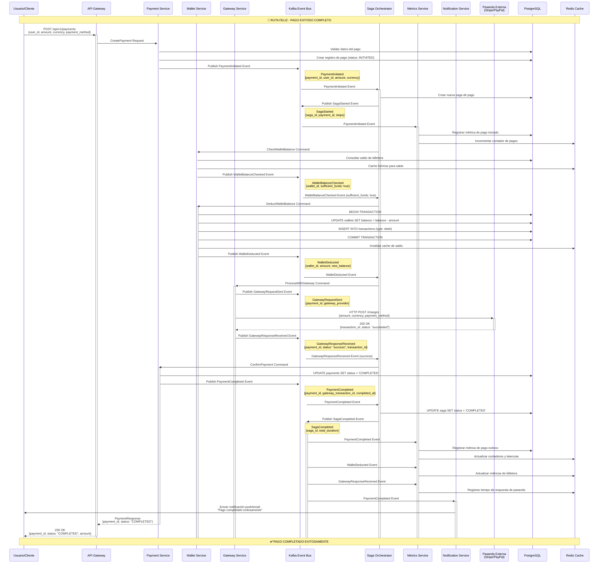

# Escenario 1 - Ruta Feliz: Flujo de Pago Exitoso

## Diagrama de Secuencia - Pago Exitoso Completo



## Eventos Clave del Flujo

### 1. PaymentInitiated
```yaml
Productor: Payment Service
Consumidores: [Saga Orchestrator, Metrics Service]
Propósito: Inicia el proceso de pago y la saga correspondiente
Schema:
  payment_id: UUID
  user_id: UUID
  amount: decimal
  currency: string
  payment_method: string
  initiated_at: timestamp
```

### 2. SagaStarted
```yaml
Productor: Saga Orchestrator
Consumidores: [Audit Service, Metrics Service]
Propósito: Registra el inicio de la saga de pago
Schema:
  saga_id: UUID
  payment_id: UUID
  saga_type: "PAYMENT_PROCESSING"
  steps: array
  started_at: timestamp
```

### 3. WalletBalanceChecked
```yaml
Productor: Wallet Service
Consumidores: [Saga Orchestrator]
Propósito: Confirma disponibilidad de fondos
Schema:
  wallet_id: UUID
  user_id: UUID
  requested_amount: decimal
  available_balance: decimal
  sufficient_funds: boolean
  checked_at: timestamp
```

### 4. WalletDeducted
```yaml
Productor: Wallet Service
Consumidores: [Saga Orchestrator, Metrics Service, Audit Service]
Propósito: Confirma deducción exitosa de fondos
Schema:
  wallet_id: UUID
  transaction_id: UUID
  amount: decimal
  previous_balance: decimal
  new_balance: decimal
  deducted_at: timestamp
```

### 5. GatewayRequestSent
```yaml
Productor: Gateway Service
Consumidores: [Metrics Service, Audit Service]
Propósito: Registra envío de solicitud a pasarela
Schema:
  payment_id: UUID
  gateway_provider: string
  request_id: string
  sent_at: timestamp
```

### 6. GatewayResponseReceived
```yaml
Productor: Gateway Service
Consumidores: [Saga Orchestrator, Metrics Service]
Propósito: Procesa respuesta de pasarela externa
Schema:
  payment_id: UUID
  gateway_transaction_id: string
  status: string
  response_time_ms: integer
  received_at: timestamp
```

### 7. PaymentCompleted
```yaml
Productor: Payment Service
Consumidores: [Saga Orchestrator, Metrics Service, Notification Service, Audit Service]
Propósito: Confirma finalización exitosa del pago
Schema:
  payment_id: UUID
  user_id: UUID
  amount: decimal
  gateway_transaction_id: string
  processing_time_ms: integer
  completed_at: timestamp
```

### 8. SagaCompleted
```yaml
Productor: Saga Orchestrator
Consumidores: [Metrics Service, Audit Service]
Propósito: Registra finalización exitosa de la saga
Schema:
  saga_id: UUID
  payment_id: UUID
  total_duration_ms: integer
  completed_steps: integer
  completed_at: timestamp
```

## Flujo de Datos y Estado

### Estados del Pago
```
INITIATED → WALLET_CHECKED → WALLET_DEDUCTED → GATEWAY_PROCESSING → COMPLETED
```

### Estados de la Saga
```
STARTED → WALLET_VALIDATION → WALLET_DEDUCTION → GATEWAY_PROCESSING → COMPLETED
```

### Transacciones de Base de Datos

#### 1. Creación del Pago
```sql
INSERT INTO payments (id, user_id, amount, currency, status, created_at)
VALUES ($1, $2, $3, $4, 'INITIATED', NOW());
```

#### 2. Deducción de Billetera (Transacción Atómica)
```sql
BEGIN;
UPDATE wallets 
SET balance = balance - $1, updated_at = NOW() 
WHERE id = $2 AND balance >= $1;

INSERT INTO transactions (wallet_id, payment_id, type, amount, currency, status)
VALUES ($2, $3, 'debit', $1, $4, 'completed');
COMMIT;
```

#### 3. Confirmación del Pago
```sql
UPDATE payments 
SET status = 'COMPLETED', 
    gateway_transaction_id = $1,
    completed_at = NOW()
WHERE id = $2;
```

## Métricas Registradas

### Métricas de Negocio
- `payments_initiated_total`: Contador de pagos iniciados
- `payments_completed_total`: Contador de pagos completados
- `payment_processing_duration_seconds`: Histograma de tiempo de procesamiento
- `payment_amount_total`: Suma total de montos procesados

### Métricas Técnicas
- `wallet_balance_checks_total`: Verificaciones de saldo
- `wallet_deductions_total`: Deducciones exitosas
- `gateway_requests_total`: Solicitudes a pasarela
- `gateway_response_time_seconds`: Tiempo de respuesta de pasarela
- `saga_duration_seconds`: Duración de sagas

## Consideraciones de Performance

### Optimizaciones Aplicadas
1. **Cache de Saldos**: Redis para consultas frecuentes de saldo
2. **Índices de DB**: Optimizados para consultas por user_id, payment_id
3. **Particionamiento**: Eventos distribuidos por user_id en Kafka
4. **Transacciones Mínimas**: Solo operaciones críticas en transacciones DB

### Tiempo Total Esperado
- **Verificación de saldo**: ~10ms
- **Deducción de billetera**: ~50ms
- **Llamada a pasarela**: ~200-500ms
- **Confirmación final**: ~20ms
- **Total**: ~300-600ms para el flujo completo
