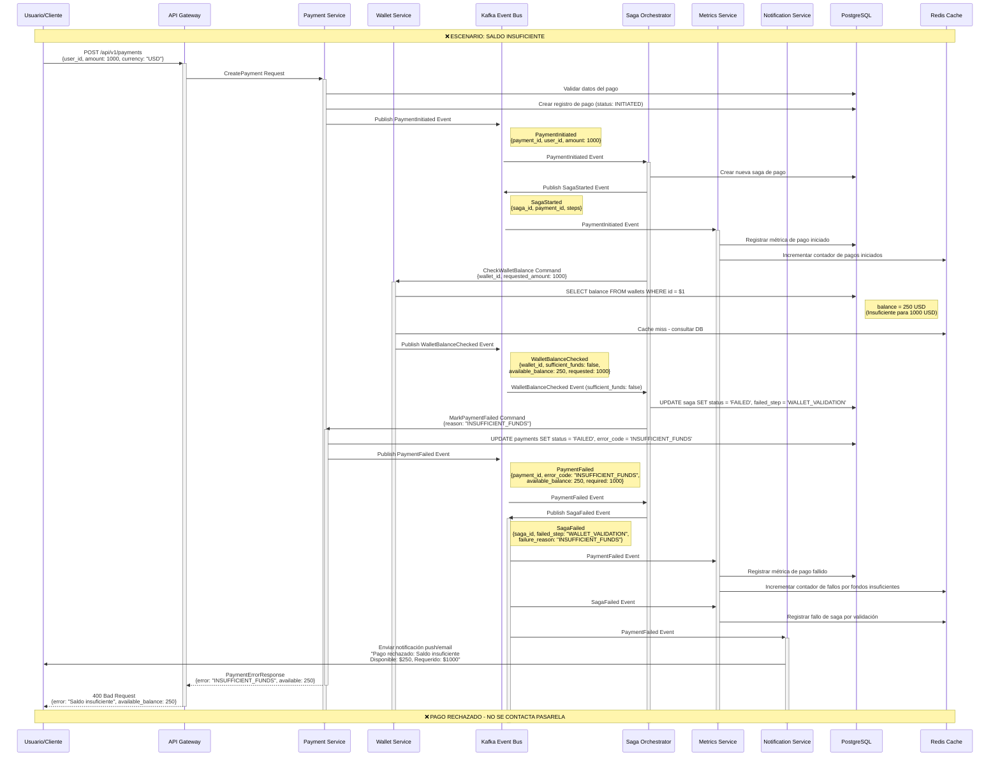

# Escenario 2 - Saldo Insuficiente: Flujo de Pago Rechazado

## Diagrama de Secuencia - Saldo Insuficiente



## Eventos Clave del Flujo de Rechazo

### 1. PaymentInitiated
```yaml
Productor: Payment Service
Consumidores: [Saga Orchestrator, Metrics Service]
Propósito: Inicia el proceso de pago (igual que ruta feliz)
Schema:
  payment_id: UUID
  user_id: UUID
  amount: decimal
  currency: string
  initiated_at: timestamp
```

### 2. WalletBalanceChecked (Fondos Insuficientes)
```yaml
Productor: Wallet Service
Consumidores: [Saga Orchestrator]
Propósito: Reporta saldo insuficiente para el pago
Schema:
  wallet_id: UUID
  user_id: UUID
  requested_amount: decimal
  available_balance: decimal
  sufficient_funds: false  # ❌ CLAVE: false
  checked_at: timestamp
  deficit_amount: decimal  # requested - available
```

### 3. PaymentFailed
```yaml
Productor: Payment Service
Consumidores: [Saga Orchestrator, Metrics Service, Notification Service, Audit Service]
Propósito: Marca el pago como fallido por fondos insuficientes
Schema:
  payment_id: UUID
  user_id: UUID
  error_code: "INSUFFICIENT_FUNDS"
  error_message: "Saldo insuficiente para procesar el pago"
  available_balance: decimal
  required_amount: decimal
  deficit_amount: decimal
  failed_at: timestamp
  failure_stage: "WALLET_VALIDATION"
```

### 4. SagaFailed
```yaml
Productor: Saga Orchestrator
Consumidores: [Metrics Service, Audit Service]
Propósito: Registra fallo de saga sin necesidad de compensación
Schema:
  saga_id: UUID
  payment_id: UUID
  failed_step: "WALLET_VALIDATION"
  failure_reason: "INSUFFICIENT_FUNDS"
  total_duration_ms: integer
  completed_steps: 1  # Solo validación inicial
  failed_at: timestamp
```

## Diferencias Clave vs Ruta Feliz

### ❌ Lo que NO ocurre en este flujo:
1. **No hay deducción de billetera** - Se detiene en la verificación
2. **No se contacta la pasarela externa** - Ahorro de costos y latencia
3. **No hay eventos de compensación** - No hay nada que revertir
4. **No hay transacciones de dinero** - Solo consultas de saldo

### ✅ Lo que SÍ ocurre:
1. **Validación temprana** - Fallo rápido en verificación de saldo
2. **Métricas de fallo** - Registro para análisis de negocio
3. **Notificación clara** - Usuario informado del motivo específico
4. **Saga terminada limpiamente** - Sin necesidad de compensación

## Estados y Transiciones

### Estados del Pago
```
INITIATED → WALLET_VALIDATION_FAILED → FAILED
```

### Estados de la Saga
```
STARTED → WALLET_VALIDATION → FAILED (sin compensación)
```

## Consultas de Base de Datos

### 1. Verificación de Saldo
```sql
SELECT 
    id,
    balance,
    currency,
    status
FROM wallets 
WHERE user_id = $1 AND currency = $2 AND status = 'ACTIVE';
```

### 2. Marcado de Pago como Fallido
```sql
UPDATE payments 
SET 
    status = 'FAILED',
    error_code = 'INSUFFICIENT_FUNDS',
    error_message = 'Saldo insuficiente para procesar el pago',
    failed_at = NOW()
WHERE id = $1;
```

### 3. Registro de Saga Fallida
```sql
UPDATE sagas 
SET 
    status = 'FAILED',
    failed_step = 'WALLET_VALIDATION',
    failure_reason = 'INSUFFICIENT_FUNDS',
    completed_at = NOW()
WHERE id = $1;
```

## Métricas Específicas de Rechazo

### Métricas de Negocio
- `payments_failed_insufficient_funds_total`: Contador de rechazos por fondos
- `payment_rejection_rate`: Tasa de rechazo por saldo insuficiente
- `average_deficit_amount`: Promedio de déficit en rechazos
- `wallet_balance_distribution`: Distribución de saldos de usuarios

### Métricas Técnicas
- `saga_failures_by_step`: Fallos de saga por etapa
- `wallet_validation_duration`: Tiempo de validación de saldo
- `early_rejection_rate`: Tasa de rechazo temprano (antes de pasarela)

## Respuesta HTTP de Error

### Estructura de Respuesta
```json
{
  "error": {
    "code": "INSUFFICIENT_FUNDS",
    "message": "Saldo insuficiente para procesar el pago",
    "details": {
      "requested_amount": 1000.00,
      "available_balance": 250.00,
      "deficit_amount": 750.00,
      "currency": "USD"
    }
  },
  "payment_id": "550e8400-e29b-41d4-a716-446655440000",
  "timestamp": "2024-01-15T10:30:00Z"
}
```

### Código de Estado HTTP
```
400 Bad Request - Cliente envió solicitud inválida (saldo insuficiente)
```

## Notificación al Usuario

### Mensaje de Notificación
```yaml
Tipo: Push Notification + Email
Título: "Pago Rechazado"
Mensaje: "Tu pago de $1,000 USD no pudo procesarse debido a saldo insuficiente. 
         Saldo disponible: $250 USD. 
         Por favor, recarga tu billetera o reduce el monto."
Acciones:
  - "Recargar Billetera"
  - "Ver Saldo Actual"
  - "Intentar Nuevo Pago"
```

## Consideraciones de Performance

### Optimizaciones
1. **Fallo rápido**: ~50ms total (vs 300-600ms de ruta feliz)
2. **Sin llamadas externas**: No hay latencia de pasarela
3. **Cache de saldos**: Verificación optimizada con Redis
4. **Validación temprana**: Ahorra recursos del sistema

### Beneficios del Rechazo Temprano
- **Menor latencia** para el usuario
- **Menor costo** (no se cobra por llamada a pasarela)
- **Mejor UX** (respuesta inmediata y clara)
- **Menos carga** en servicios downstream
