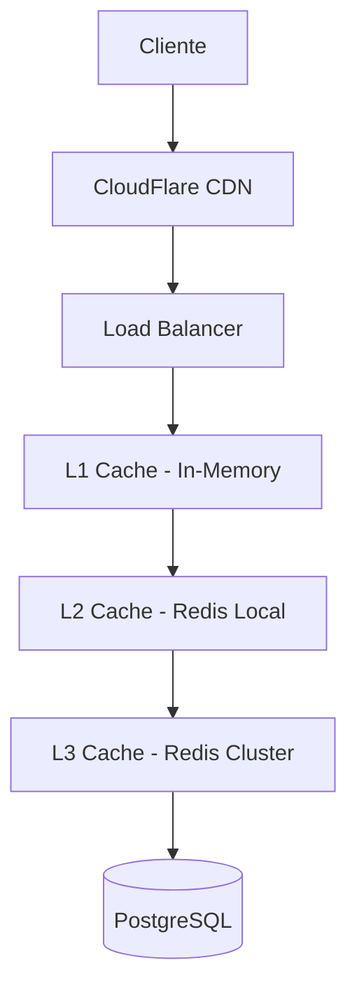

# Plan de Escalabilidad del Sistema de Pagos

## Índice
1. [Escalado Horizontal de Servicios](#escalado-horizontal-de-servicios)
2. [Balanceo de Carga y Alta Disponibilidad](#balanceo-de-carga-y-alta-disponibilidad)
3. [Particionado de Datos](#particionado-de-datos)
4. [Estrategias de Caché](#estrategias-de-caché)
5. [Identificación de Cuellos de Botella](#identificación-de-cuellos-de-botella)
6. [Métricas de Escalabilidad](#métricas-de-escalabilidad)

---

## Escalado Horizontal de Servicios

### Arquitectura Stateless

```yaml
Service_Design_Principles:
  - Servicios sin estado (stateless)
  - Configuración externalized
  - Datos compartidos solo via DB/Cache
  - Idempotencia en todas las operaciones
```

### Deployment con Kubernetes

```yaml
# payment-service-deployment.yaml
apiVersion: apps/v1
kind: Deployment
metadata:
  name: payment-service
spec:
  replicas: 5  # Escalable dinámicamente
  selector:
    matchLabels:
      app: payment-service
  template:
    spec:
      containers:
      - name: payment-service
        image: payment-service:latest
        resources:
          requests:
            cpu: "500m"
            memory: "1Gi"
          limits:
            cpu: "1000m"
            memory: "2Gi"
        env:
        - name: KAFKA_BROKERS
          value: "kafka-cluster:9092"
        - name: DB_HOST
          value: "postgres-cluster"
---
apiVersion: v1
kind: Service
metadata:
  name: payment-service-svc
spec:
  selector:
    app: payment-service
  ports:
  - port: 8080
    targetPort: 8080
  type: ClusterIP
```

### Horizontal Pod Autoscaler (HPA)

```yaml
apiVersion: autoscaling/v2
kind: HorizontalPodAutoscaler
metadata:
  name: payment-service-hpa
spec:
  scaleTargetRef:
    apiVersion: apps/v1
    kind: Deployment
    name: payment-service
  minReplicas: 3
  maxReplicas: 20
  metrics:
  - type: Resource
    resource:
      name: cpu
      target:
        type: Utilization
        averageUtilization: 70
  - type: Resource
    resource:
      name: memory
      target:
        type: Utilization
        averageUtilization: 80
  - type: Pods
    pods:
      metric:
        name: kafka_consumer_lag
      target:
        type: AverageValue
        averageValue: "1000"
```

### Escalado por Servicio

#### Payment Service
```yaml
Scaling_Strategy:
  min_replicas: 3
  max_replicas: 20
  target_cpu: 70%
  target_memory: 80%
  
Scaling_Triggers:
  - HTTP request rate > 1000 RPS
  - Payment processing queue > 5000 messages
  - Response time p99 > 500ms
```

#### Wallet Service
```yaml
Scaling_Strategy:
  min_replicas: 5  # Más crítico por consistencia
  max_replicas: 15
  target_cpu: 60%
  
Scaling_Triggers:
  - Wallet operations > 2000 TPS
  - Event processing lag > 2000 messages
  - Database connection pool > 80%
```

#### Gateway Service
```yaml
Scaling_Strategy:
  min_replicas: 2
  max_replicas: 10
  target_cpu: 80%
  
Scaling_Triggers:
  - External API calls > 500 RPS
  - Circuit breaker activation rate > 5%
  - Gateway response time > 2s
```

### Consumer Group Scaling

```go
// Kafka consumer group auto-scaling
type ConsumerGroupManager struct {
    groupID     string
    topics      []string
    minConsumers int
    maxConsumers int
    lagThreshold int64
}

func (cgm *ConsumerGroupManager) ScaleConsumers() {
    lag := cgm.getCurrentLag()
    currentConsumers := cgm.getCurrentConsumerCount()
    
    if lag > cgm.lagThreshold && currentConsumers < cgm.maxConsumers {
        cgm.addConsumer()
    } else if lag < cgm.lagThreshold/2 && currentConsumers > cgm.minConsumers {
        cgm.removeConsumer()
    }
}
```

---

## Balanceo de Carga y Alta Disponibilidad

### API Gateway con Load Balancing

```yaml
# nginx-ingress configuration
apiVersion: networking.k8s.io/v1
kind: Ingress
metadata:
  name: payment-api-ingress
  annotations:
    nginx.ingress.kubernetes.io/load-balance: "round_robin"
    nginx.ingress.kubernetes.io/upstream-hash-by: "$request_uri"
    nginx.ingress.kubernetes.io/rate-limit: "1000"
    nginx.ingress.kubernetes.io/rate-limit-window: "1m"
spec:
  rules:
  - host: api.payments.com
    http:
      paths:
      - path: /api/v1/payments
        pathType: Prefix
        backend:
          service:
            name: payment-service-svc
            port:
              number: 8080
      - path: /api/v1/wallets
        pathType: Prefix
        backend:
          service:
            name: wallet-service-svc
            port:
              number: 8080
```

### Kafka Partitioning Strategy

```yaml
Topic_Partitioning:
  payment-events:
    partitions: 24  # Múltiplo del número máx de consumidores
    partition_key: user_id
    strategy: "Consistent hashing por user_id"
    
  wallet-events:
    partitions: 16
    partition_key: wallet_id
    strategy: "Garantiza orden por billetera"
    
  gateway-events:
    partitions: 12
    partition_key: payment_id
    strategy: "Agrupa eventos de mismo pago"
```

### Consumer Group Distribution

```go
// Configuración de consumer groups
type KafkaConsumerConfig struct {
    GroupID                string
    Topics                 []string
    PartitionAssignment    string // "range", "roundrobin", "sticky"
    SessionTimeout         time.Duration
    HeartbeatInterval      time.Duration
    MaxPollRecords         int
    AutoOffsetReset        string
}

var ConsumerConfigs = map[string]KafkaConsumerConfig{
    "payment-processors": {
        GroupID:             "payment-service-group",
        Topics:              []string{"payment-events"},
        PartitionAssignment: "sticky", // Minimiza rebalancing
        SessionTimeout:      30 * time.Second,
        HeartbeatInterval:   10 * time.Second,
        MaxPollRecords:      500,
        AutoOffsetReset:     "earliest",
    },
}
```

### Database High Availability

#### PostgreSQL Cluster con Patroni

```yaml
PostgreSQL_HA:
  architecture: "Primary-Replica with automatic failover"
  nodes: 3
  replication: "Streaming replication"
  failover_tool: "Patroni + etcd"
  
Connection_Pooling:
  tool: "PgBouncer"
  read_replicas: 2
  write_primary: 1
  connection_distribution:
    - writes: primary only
    - reads: round-robin across replicas
```

#### Read/Write Splitting

```go
type DatabaseManager struct {
    writeDB *sql.DB  // Primary
    readDBs []*sql.DB // Replicas
    current int
}

func (dm *DatabaseManager) GetReadDB() *sql.DB {
    // Round-robin entre replicas
    db := dm.readDBs[dm.current]
    dm.current = (dm.current + 1) % len(dm.readDBs)
    return db
}

func (dm *DatabaseManager) GetWriteDB() *sql.DB {
    return dm.writeDB
}
```

---

## Particionado de Datos

### Event Store Partitioning

#### Particionamiento Temporal

```sql
-- Particionamiento por mes para eventos
CREATE TABLE events (
    event_id UUID NOT NULL,
    aggregate_id UUID NOT NULL,
    event_type VARCHAR(100) NOT NULL,
    event_data JSONB NOT NULL,
    event_version BIGINT NOT NULL,
    occurred_at TIMESTAMP WITH TIME ZONE NOT NULL
) PARTITION BY RANGE (occurred_at);

-- Particiones mensuales
CREATE TABLE events_2024_01 PARTITION OF events
    FOR VALUES FROM ('2024-01-01') TO ('2024-02-01');
    
CREATE TABLE events_2024_02 PARTITION OF events
    FOR VALUES FROM ('2024-02-01') TO ('2024-03-01');

-- Automatización de creación de particiones
CREATE OR REPLACE FUNCTION create_monthly_partition()
RETURNS void AS $$
DECLARE
    start_date date;
    end_date date;
    partition_name text;
BEGIN
    start_date := date_trunc('month', CURRENT_DATE + interval '1 month');
    end_date := start_date + interval '1 month';
    partition_name := 'events_' || to_char(start_date, 'YYYY_MM');
    
    EXECUTE format('CREATE TABLE %I PARTITION OF events
                   FOR VALUES FROM (%L) TO (%L)',
                   partition_name, start_date, end_date);
END;
$$ LANGUAGE plpgsql;
```

#### Particionamiento por Usuario (Sharding)

```sql
-- Sharding por hash de user_id
CREATE TABLE wallet_events (
    event_id UUID NOT NULL,
    wallet_id UUID NOT NULL,
    user_id UUID NOT NULL,
    event_data JSONB NOT NULL,
    occurred_at TIMESTAMP WITH TIME ZONE NOT NULL
) PARTITION BY HASH (user_id);

-- 8 shards para distribución uniforme
CREATE TABLE wallet_events_0 PARTITION OF wallet_events
    FOR VALUES WITH (modulus 8, remainder 0);
    
CREATE TABLE wallet_events_1 PARTITION OF wallet_events
    FOR VALUES WITH (modulus 8, remainder 1);
-- ... hasta wallet_events_7
```

### Read Model Partitioning

```sql
-- Vista materializada particionada para saldos
CREATE MATERIALIZED VIEW wallet_balances (
    wallet_id UUID,
    user_id UUID,
    currency VARCHAR(3),
    balance DECIMAL(15,2),
    last_updated TIMESTAMP WITH TIME ZONE
) PARTITION BY HASH (user_id);

-- Particiones para paralelizar refreshes
CREATE MATERIALIZED VIEW wallet_balances_0 PARTITION OF wallet_balances
    FOR VALUES WITH (modulus 4, remainder 0);
-- ... hasta wallet_balances_3
```

### Database Sharding Strategy

```go
type ShardManager struct {
    shards map[int]*sql.DB
    hasher hash.Hash64
}

func (sm *ShardManager) GetShardForUser(userID string) *sql.DB {
    sm.hasher.Reset()
    sm.hasher.Write([]byte(userID))
    shardID := int(sm.hasher.Sum64() % uint64(len(sm.shards)))
    return sm.shards[shardID]
}

func (sm *ShardManager) GetAllShards() []*sql.DB {
    shards := make([]*sql.DB, 0, len(sm.shards))
    for _, db := range sm.shards {
        shards = append(shards, db)
    }
    return shards
}
```

---

## Estrategias de Caché

### Multi-Layer Caching



### L1 Cache (In-Memory)

```go
type InMemoryCache struct {
    cache map[string]CacheItem
    mutex sync.RWMutex
    ttl   time.Duration
}

type CacheItem struct {
    Value     interface{}
    ExpiresAt time.Time
}

func (c *InMemoryCache) Get(key string) (interface{}, bool) {
    c.mutex.RLock()
    defer c.mutex.RUnlock()
    
    item, exists := c.cache[key]
    if !exists || time.Now().After(item.ExpiresAt) {
        return nil, false
    }
    
    return item.Value, true
}

// Cache para configuración y datos estáticos
var ConfigCache = NewInMemoryCache(10 * time.Minute)
```

### L2/L3 Cache (Redis)

```go
type CacheStrategy struct {
    Local   *redis.Client    // L2 - Redis local
    Cluster *redis.ClusterClient // L3 - Redis cluster
}

func (cs *CacheStrategy) GetWalletBalance(walletID string) (decimal.Decimal, error) {
    key := "wallet:balance:" + walletID
    
    // L2 Cache (local Redis)
    if val, err := cs.Local.Get(ctx, key).Result(); err == nil {
        return decimal.NewFromString(val)
    }
    
    // L3 Cache (Redis cluster)
    if val, err := cs.Cluster.Get(ctx, key).Result(); err == nil {
        // Populate L2
        cs.Local.Set(ctx, key, val, 1*time.Minute)
        return decimal.NewFromString(val)
    }
    
    // Fallback to database
    balance, err := cs.getBalanceFromDB(walletID)
    if err != nil {
        return decimal.Zero, err
    }
    
    // Populate all cache levels
    balanceStr := balance.String()
    cs.Cluster.Set(ctx, key, balanceStr, 5*time.Minute)
    cs.Local.Set(ctx, key, balanceStr, 1*time.Minute)
    
    return balance, nil
}
```

### Cache Invalidation Strategy

```go
type CacheInvalidator struct {
    redis   *redis.ClusterClient
    pattern map[string][]string // event -> cache keys to invalidate
}

func (ci *CacheInvalidator) HandleWalletDeducted(event WalletDeductedEvent) {
    keys := []string{
        "wallet:balance:" + event.WalletID,
        "user:wallets:" + event.UserID,
        "wallet:transactions:" + event.WalletID,
    }
    
    // Invalidate cache keys
    for _, key := range keys {
        ci.redis.Del(ctx, key)
    }
    
    // Update cache with new value
    ci.redis.Set(ctx, "wallet:balance:"+event.WalletID, 
                 event.NewBalance.String(), 5*time.Minute)
}
```

### CDN for Static Content

```yaml
CDN_Configuration:
  provider: "CloudFlare"
  cached_content:
    - API documentation
    - Static configuration
    - Rate limit responses
    - Error pages
  
  cache_rules:
    - path: "/api/v1/config/*"
      ttl: "1 hour"
    - path: "/api/v1/rates/*"
      ttl: "5 minutes"
    - path: "/docs/*"
      ttl: "24 hours"
```

---

## Identificación de Cuellos de Botella

### Monitoreo Proactivo

#### Métricas de Performance

```yaml
Key_Performance_Indicators:
  Throughput:
    - requests_per_second_by_service
    - events_processed_per_second
    - database_transactions_per_second
    
  Latency:
    - api_response_time_p50_p95_p99
    - event_processing_latency
    - database_query_time
    
  Utilization:
    - cpu_utilization_by_pod
    - memory_utilization_by_pod
    - database_connection_pool_usage
    - kafka_consumer_lag
    
  Error_Rates:
    - http_error_rate_by_endpoint
    - event_processing_error_rate
    - database_error_rate
```

#### Alertas de Cuellos de Botella

```yaml
Bottleneck_Alerts:
  High_Latency:
    condition: "api_response_time_p99 > 1000ms"
    action: "Scale API pods horizontally"
    
  Consumer_Lag:
    condition: "kafka_consumer_lag > 10000"
    action: "Add more consumer instances"
    
  Database_Connections:
    condition: "db_connection_pool_usage > 90%"
    action: "Increase connection pool or add read replica"
    
  Memory_Pressure:
    condition: "memory_utilization > 85%"
    action: "Scale pods or increase memory limits"
    
  Circuit_Breaker:
    condition: "circuit_breaker_open_rate > 10%"
    action: "Investigate external service issues"
```

### Bottleneck Detection Algorithm

```go
type BottleneckDetector struct {
    metrics MetricsCollector
    thresholds map[string]Threshold
    actions map[string]ScalingAction
}

type Threshold struct {
    Warning  float64
    Critical float64
    Duration time.Duration
}

func (bd *BottleneckDetector) DetectBottlenecks() []Bottleneck {
    var bottlenecks []Bottleneck
    
    // Check API latency
    if latency := bd.metrics.GetAPILatencyP99(); latency > 1000 {
        bottlenecks = append(bottlenecks, Bottleneck{
            Type: "API_LATENCY",
            Severity: "HIGH",
            Value: latency,
            Recommendation: "Scale API gateway and service pods",
        })
    }
    
    // Check Kafka consumer lag
    if lag := bd.metrics.GetConsumerLag(); lag > 10000 {
        bottlenecks = append(bottlenecks, Bottleneck{
            Type: "CONSUMER_LAG",
            Severity: "CRITICAL",
            Value: float64(lag),
            Recommendation: "Add more consumer instances",
        })
    }
    
    // Check database performance
    if connUsage := bd.metrics.GetDBConnectionUsage(); connUsage > 0.9 {
        bottlenecks = append(bottlenecks, Bottleneck{
            Type: "DB_CONNECTIONS",
            Severity: "HIGH",
            Value: connUsage,
            Recommendation: "Increase connection pool or add read replica",
        })
    }
    
    return bottlenecks
}
```

### Auto-Scaling Actions

```go
type AutoScaler struct {
    k8sClient kubernetes.Interface
    detector  *BottleneckDetector
}

func (as *AutoScaler) HandleBottleneck(bottleneck Bottleneck) error {
    switch bottleneck.Type {
    case "API_LATENCY":
        return as.scaleDeployment("payment-service", 2) // Add 2 replicas
        
    case "CONSUMER_LAG":
        return as.scaleConsumerGroup("payment-processors", 3)
        
    case "DB_CONNECTIONS":
        return as.addReadReplica("postgres-cluster")
        
    case "MEMORY_PRESSURE":
        return as.increaseMemoryLimits("payment-service", "4Gi")
    }
    
    return nil
}
```

### Performance Testing Strategy

```yaml
Load_Testing:
  tool: "k6"
  scenarios:
    - name: "Normal Load"
      rps: 1000
      duration: "10m"
      
    - name: "Peak Load"
      rps: 5000
      duration: "5m"
      
    - name: "Stress Test"
      rps: 10000
      duration: "2m"
      
  metrics_to_monitor:
    - Response time percentiles
    - Error rates
    - Resource utilization
    - Database performance
    - Kafka consumer lag
```

### Capacity Planning

```yaml
Growth_Projections:
  current_load:
    payments_per_day: 100000
    peak_rps: 1000
    
  6_month_projection:
    payments_per_day: 500000
    peak_rps: 5000
    
  1_year_projection:
    payments_per_day: 1000000
    peak_rps: 10000

Resource_Planning:
  current_resources:
    api_pods: 5
    db_connections: 100
    kafka_partitions: 12
    
  6_month_resources:
    api_pods: 20
    db_connections: 500
    kafka_partitions: 24
    
  1_year_resources:
    api_pods: 50
    db_connections: 1000
    kafka_partitions: 48
```

Este plan de escalabilidad proporciona una estrategia integral para manejar el crecimiento del sistema de pagos, desde el escalado automático hasta la detección proactiva de cuellos de botella y la planificación de capacidad a largo plazo.
