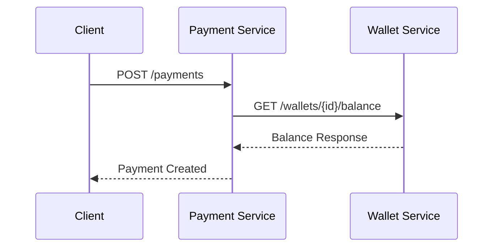
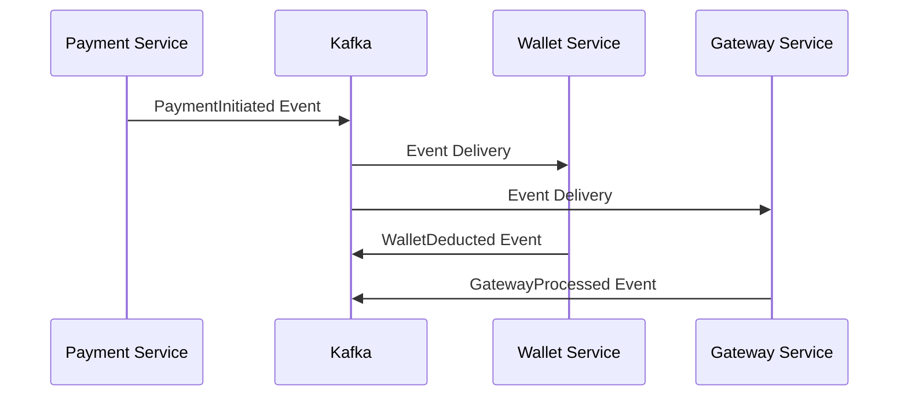

# Diseño Detallado de Servicios

## Índice
1. [Payment Service](#payment-service)
2. [Wallet Service](#wallet-service)
3. [Gateway Service](#gateway-service)
4. [Metrics Service](#metrics-service)
5. [Saga Orchestrator](#saga-orchestrator)
6. [Patrones de Comunicación](#patrones-de-comunicación)
7. [Matriz de Dependencias](#matriz-de-dependencias)

---

## Payment Service

### Límites y Responsabilidades

**Dominio**: Orquestación y gestión del ciclo de vida de pagos

**Responsabilidades Principales**:
- ✅ Validar solicitudes de pago (formato, montos, monedas)
- ✅ Orquestar el flujo completo de procesamiento de pagos
- ✅ Mantener el estado de las transacciones de pago
- ✅ Coordinar con Wallet Service y Gateway Service
- ✅ Implementar reglas de negocio específicas de pagos
- ✅ Generar identificadores únicos de transacción
- ✅ Manejar timeouts y reintentos de transacciones

**Límites del Servicio**:
- ❌ NO maneja saldos de billetera directamente
- ❌ NO se comunica directamente con pasarelas externas
- ❌ NO almacena métricas de rendimiento
- ❌ NO maneja compensaciones de saga (delegado al Orchestrator)

### Eventos Publicados

```yaml
PaymentInitiated:
  schema:
    aggregate_id: string (UUID)
    user_id: string
    amount: decimal
    currency: string
    payment_method: string
    timestamp: datetime
  trigger: Al recibir solicitud de pago válida
  consumers: [Saga Orchestrator, Metrics Service]

PaymentCompleted:
  schema:
    aggregate_id: string (UUID)
    user_id: string
    amount: decimal
    gateway_transaction_id: string
    processed_at: datetime
  trigger: Cuando Gateway Service confirma éxito
  consumers: [Saga Orchestrator, Metrics Service, Audit Service]

PaymentFailed:
  schema:
    aggregate_id: string (UUID)
    user_id: string
    error_code: string
    error_message: string
    failed_at: datetime
  trigger: En caso de fallo en cualquier etapa
  consumers: [Saga Orchestrator, Metrics Service]

PaymentCancelled:
  schema:
    aggregate_id: string (UUID)
    user_id: string
    cancelled_by: string
    reason: string
    cancelled_at: datetime
  trigger: Cancelación manual o automática
  consumers: [Saga Orchestrator, Wallet Service]
```

### Eventos Suscritos

```yaml
WalletDeducted:
  action: Proceder con Gateway Service
  source: Wallet Service

WalletDeductionFailed:
  action: Marcar pago como fallido
  source: Wallet Service

GatewayProcessed:
  action: Completar transacción
  source: Gateway Service

GatewayFailed:
  action: Iniciar compensación
  source: Gateway Service

SagaCompensationRequired:
  action: Revertir estado de pago
  source: Saga Orchestrator
```

### Dependencias y Comunicación

**Dependencias Directas**:
- `Wallet Service` (Síncrona): Verificación de saldo
- `Gateway Service` (Asíncrona): Procesamiento con pasarela
- `Event Bus` (Asíncrona): Publicación de eventos

**Patrones de Comunicación**:
- **API REST**: Endpoints públicos para clientes
- **Event-Driven**: Comunicación con otros servicios
- **Request-Reply**: Para verificaciones críticas de saldo

---

## Wallet Service

### Límites y Responsabilidades

**Dominio**: Gestión de billeteras digitales y saldos de usuarios

**Responsabilidades Principales**:
- ✅ Mantener saldos por usuario y moneda
- ✅ Procesar deducciones y reembolsos
- ✅ Validar disponibilidad de fondos
- ✅ Mantener historial de transacciones de billetera
- ✅ Implementar bloqueos optimistas para concurrencia
- ✅ Generar reportes de saldos y movimientos
- ✅ Manejar múltiples monedas

**Límites del Servicio**:
- ❌ NO inicia procesos de pago
- ❌ NO se comunica con pasarelas externas
- ❌ NO maneja lógica de negocio de pagos
- ❌ NO decide sobre compensaciones de saga

### Eventos Publicados

```yaml
WalletDeducted:
  schema:
    wallet_id: string (UUID)
    user_id: string
    amount: decimal
    currency: string
    previous_balance: decimal
    new_balance: decimal
    transaction_id: string
    deducted_at: datetime
  trigger: Deducción exitosa de saldo
  consumers: [Payment Service, Metrics Service, Audit Service]

WalletDeductionFailed:
  schema:
    wallet_id: string (UUID)
    user_id: string
    requested_amount: decimal
    current_balance: decimal
    error_code: string
    failed_at: datetime
  trigger: Fallo en deducción (saldo insuficiente, etc.)
  consumers: [Payment Service, Saga Orchestrator]

WalletRefunded:
  schema:
    wallet_id: string (UUID)
    user_id: string
    amount: decimal
    currency: string
    previous_balance: decimal
    new_balance: decimal
    refund_reason: string
    refunded_at: datetime
  trigger: Reembolso exitoso
  consumers: [Metrics Service, Audit Service]

WalletBalanceUpdated:
  schema:
    wallet_id: string (UUID)
    user_id: string
    currency: string
    new_balance: decimal
    updated_at: datetime
  trigger: Cualquier cambio de saldo
  consumers: [Metrics Service]
```

### Eventos Suscritos

```yaml
PaymentInitiated:
  action: Preparar deducción (reserva temporal)
  source: Payment Service

SagaCompensationRequired:
  action: Reembolsar cantidad deducida
  source: Saga Orchestrator

WalletTopUpRequested:
  action: Aumentar saldo de billetera
  source: External Top-up Service
```

### Dependencias y Comunicación

**Dependencias Directas**:
- `PostgreSQL` (Síncrona): Persistencia de saldos
- `Redis` (Síncrona): Cache de saldos frecuentes
- `Event Bus` (Asíncrona): Notificación de cambios

**Patrones de Comunicación**:
- **Database per Service**: Base de datos dedicada
- **Event Sourcing**: Historial completo de transacciones
- **Optimistic Locking**: Manejo de concurrencia

---

## Gateway Service

### Límites y Responsabilidades

**Dominio**: Integración con pasarelas de pago externas

**Responsabilidades Principales**:
- ✅ Abstraer diferencias entre proveedores (Stripe, PayPal, etc.)
- ✅ Implementar Circuit Breaker para resiliencia
- ✅ Manejar autenticación con pasarelas externas
- ✅ Transformar formatos de datos entre sistemas
- ✅ Implementar reintentos con backoff exponencial
- ✅ Monitorear latencia y disponibilidad de pasarelas
- ✅ Manejar webhooks de pasarelas externas

**Límites del Servicio**:
- ❌ NO mantiene estado de pagos
- ❌ NO maneja saldos de billetera
- ❌ NO implementa reglas de negocio de pagos
- ❌ NO decide sobre compensaciones

### Eventos Publicados

```yaml
GatewayProcessed:
  schema:
    payment_id: string (UUID)
    gateway_transaction_id: string
    gateway_provider: string
    amount: decimal
    currency: string
    processing_time: duration
    processed_at: datetime
  trigger: Respuesta exitosa de pasarela
  consumers: [Payment Service, Metrics Service]

GatewayFailed:
  schema:
    payment_id: string (UUID)
    gateway_provider: string
    error_code: string
    error_message: string
    retry_count: integer
    failed_at: datetime
  trigger: Fallo en procesamiento con pasarela
  consumers: [Payment Service, Saga Orchestrator]

GatewayResponseReceived:
  schema:
    payment_id: string (UUID)
    gateway_provider: string
    response_time: duration
    status_code: integer
    received_at: datetime
  trigger: Cualquier respuesta de pasarela
  consumers: [Metrics Service]

CircuitBreakerOpened:
  schema:
    gateway_provider: string
    failure_count: integer
    opened_at: datetime
  trigger: Circuit breaker se abre
  consumers: [Metrics Service, Alert Service]
```

### Eventos Suscritos

```yaml
PaymentInitiated:
  action: Procesar pago con pasarela apropiada
  source: Payment Service

GatewayWebhookReceived:
  action: Procesar notificación asíncrona
  source: External Gateway
```

### Dependencias y Comunicación

**Dependencias Directas**:
- `External Payment Gateways` (Síncrona): APIs de Stripe, PayPal
- `Redis` (Síncrona): Estado de Circuit Breaker
- `Event Bus` (Asíncrona): Notificación de resultados

**Patrones de Comunicación**:
- **Circuit Breaker**: Protección contra fallos de pasarelas
- **Adapter Pattern**: Unificación de interfaces de pasarelas
- **Retry Pattern**: Reintentos con backoff exponencial

---

## Metrics Service

### Límites y Responsabilidades

**Dominio**: Recopilación, procesamiento y exposición de métricas del sistema

**Responsabilidades Principales**:
- ✅ Recopilar métricas de todos los servicios
- ✅ Calcular KPIs de negocio en tiempo real
- ✅ Mantener contadores y histogramas de rendimiento
- ✅ Generar alertas basadas en umbrales
- ✅ Exponer métricas en formato Prometheus
- ✅ Mantener dashboards de salud del sistema
- ✅ Procesar eventos para análisis de tendencias

**Límites del Servicio**:
- ❌ NO inicia procesos de negocio
- ❌ NO modifica estado de otros servicios
- ❌ NO maneja transacciones de pago
- ❌ NO almacena datos transaccionales

### Eventos Publicados

```yaml
AlertTriggered:
  schema:
    alert_id: string (UUID)
    alert_type: string
    severity: string (LOW, MEDIUM, HIGH, CRITICAL)
    metric_name: string
    current_value: decimal
    threshold_value: decimal
    triggered_at: datetime
  trigger: Métrica excede umbral configurado
  consumers: [Notification Service, Operations Team]

MetricThresholdUpdated:
  schema:
    metric_name: string
    old_threshold: decimal
    new_threshold: decimal
    updated_by: string
    updated_at: datetime
  trigger: Actualización de configuración de alertas
  consumers: [Audit Service]
```

### Eventos Suscritos

```yaml
PaymentInitiated:
  action: Incrementar contador de pagos iniciados
  source: Payment Service

PaymentCompleted:
  action: Registrar tiempo de procesamiento y éxito
  source: Payment Service

PaymentFailed:
  action: Incrementar contador de fallos
  source: Payment Service

WalletDeducted:
  action: Actualizar métricas de billetera
  source: Wallet Service

GatewayResponseReceived:
  action: Registrar latencia de pasarela
  source: Gateway Service

CircuitBreakerOpened:
  action: Registrar evento de circuit breaker
  source: Gateway Service
```

### Dependencias y Comunicación

**Dependencias Directas**:
- `Redis` (Síncrona): Almacenamiento de métricas temporales
- `Prometheus` (Síncrona): Exposición de métricas
- `Event Bus` (Asíncrona): Recepción de eventos

**Patrones de Comunicación**:
- **Observer Pattern**: Reacción a eventos del sistema
- **Time Series**: Almacenamiento de métricas temporales
- **Pull Model**: Prometheus extrae métricas

---

## Saga Orchestrator

### Límites y Responsabilidades

**Dominio**: Coordinación de transacciones distribuidas y manejo de compensaciones

**Responsabilidades Principales**:
- ✅ Coordinar transacciones distribuidas entre servicios
- ✅ Implementar patrones de compensación automática
- ✅ Mantener estado de sagas en progreso
- ✅ Manejar timeouts de transacciones distribuidas
- ✅ Implementar reintentos de pasos fallidos
- ✅ Generar eventos de auditoría de sagas
- ✅ Proporcionar visibilidad del estado de transacciones

**Límites del Servicio**:
- ❌ NO implementa lógica de negocio específica
- ❌ NO maneja datos de dominio directamente
- ❌ NO se comunica con sistemas externos
- ❌ NO toma decisiones de negocio

### Eventos Publicados

```yaml
SagaStarted:
  schema:
    saga_id: string (UUID)
    saga_type: string
    correlation_id: string
    steps: array
    started_at: datetime
  trigger: Inicio de nueva saga
  consumers: [Audit Service, Metrics Service]

SagaCompleted:
  schema:
    saga_id: string (UUID)
    correlation_id: string
    total_duration: duration
    completed_at: datetime
  trigger: Finalización exitosa de saga
  consumers: [Audit Service, Metrics Service]

SagaFailed:
  schema:
    saga_id: string (UUID)
    correlation_id: string
    failed_step: string
    error_reason: string
    failed_at: datetime
  trigger: Fallo irrecuperable de saga
  consumers: [Audit Service, Alert Service]

CompensationStarted:
  schema:
    saga_id: string (UUID)
    correlation_id: string
    compensation_steps: array
    started_at: datetime
  trigger: Inicio de proceso de compensación
  consumers: [Payment Service, Wallet Service, Audit Service]

CompensationCompleted:
  schema:
    saga_id: string (UUID)
    correlation_id: string
    compensated_steps: array
    completed_at: datetime
  trigger: Finalización de compensación
  consumers: [Audit Service, Metrics Service]
```

### Eventos Suscritos

```yaml
PaymentInitiated:
  action: Iniciar saga de pago
  source: Payment Service

WalletDeducted:
  action: Avanzar al siguiente paso de saga
  source: Wallet Service

GatewayProcessed:
  action: Completar saga exitosamente
  source: Gateway Service

PaymentFailed:
  action: Iniciar compensación
  source: Payment Service

WalletDeductionFailed:
  action: Marcar saga como fallida
  source: Wallet Service

GatewayFailed:
  action: Iniciar compensación de billetera
  source: Gateway Service
```

### Dependencias y Comunicación

**Dependencias Directas**:
- `PostgreSQL` (Síncrona): Persistencia de estado de sagas
- `Event Bus` (Asíncrona): Coordinación con servicios
- `Redis` (Síncrona): Cache de sagas activas

**Patrones de Comunicación**:
- **Saga Pattern**: Transacciones distribuidas
- **State Machine**: Gestión de estados de saga
- **Event Sourcing**: Historial de pasos de saga

---

## Patrones de Comunicación

### Comunicación Síncrona (Request-Response)



**Casos de Uso**:
- Verificación de saldo antes de procesar pago
- Consultas de estado en tiempo real
- Operaciones que requieren respuesta inmediata

### Comunicación Asíncrona (Event-Driven)



**Casos de Uso**:
- Procesamiento de pagos en background
- Notificaciones entre servicios
- Operaciones que pueden tolerar latencia

### Patrones de Resiliencia

**Circuit Breaker**:
```yaml
Implementation: Gateway Service
Purpose: Proteger contra fallos de pasarelas externas
States: [CLOSED, OPEN, HALF_OPEN]
Thresholds:
  failure_rate: 50%
  minimum_requests: 10
  timeout: 60s
```

**Retry Pattern**:
```yaml
Implementation: Todos los servicios
Strategy: Exponential Backoff with Jitter
Max_Retries: 3
Base_Delay: 100ms
Max_Delay: 5s
```

**Bulkhead Pattern**:
```yaml
Implementation: Thread pools separados por operación
Purpose: Aislar fallos entre diferentes tipos de operaciones
Pools:
  - payment_processing: 10 threads
  - wallet_operations: 5 threads
  - gateway_calls: 8 threads
```

---

## Matriz de Dependencias

| Servicio | Payment | Wallet | Gateway | Metrics | Saga | External |
|----------|---------|--------|---------|---------|------|----------|
| **Payment Service** | - | Sync (REST) | Async (Events) | Async (Events) | Async (Events) | - |
| **Wallet Service** | Async (Events) | - | - | Async (Events) | Async (Events) | - |
| **Gateway Service** | Async (Events) | - | - | Async (Events) | Async (Events) | Sync (REST) |
| **Metrics Service** | Async (Events) | Async (Events) | Async (Events) | - | Async (Events) | Sync (Prometheus) |
| **Saga Orchestrator** | Async (Events) | Async (Events) | Async (Events) | Async (Events) | - | - |

### Justificación de Desacoplamiento

**1. Separación de Responsabilidades**:
- Cada servicio tiene un dominio bien definido
- No hay solapamiento de responsabilidades
- Interfaces claras entre servicios

**2. Autonomía de Servicios**:
- Cada servicio puede evolucionar independientemente
- Deployments independientes
- Escalado independiente

**3. Tolerancia a Fallos**:
- Fallos en un servicio no afectan directamente a otros
- Circuit breakers protegen contra cascadas de fallos
- Compensaciones automáticas mantienen consistencia

**4. Cohesión Interna**:
- Cada servicio agrupa funcionalidades relacionadas
- Datos y operaciones están co-localizados
- Interfaces mínimas y bien definidas
