# Escenario 5 - Recuperación del Sistema: Event Sourcing y Resiliencia

## Diagrama de Secuencia - Recuperación tras Falla Completa

```mermaid
sequenceDiagram
    participant OPS as Operations Team
    participant K8S as Kubernetes
    participant PS as Payment Service
    participant WS as Wallet Service
    participant GS as Gateway Service
    participant SO as Saga Orchestrator
    participant MS as Metrics Service
    participant K as Kafka Event Bus
    participant ES as Event Store<br/>(PostgreSQL)
    participant RM as Read Models<br/>(PostgreSQL)
    participant R as Redis Cache
    participant HC as Health Check

    Note over OPS,HC: 💥 FALLA COMPLETA DEL SISTEMA

    %% 1. Detección de falla y reinicio
    OPS->>+K8S: kubectl apply -f deployment.yaml<br/>Reiniciar todos los servicios
    
    %% 2. Inicio secuencial de servicios críticos
    K8S->>+K: Iniciar Kafka Cluster
    K->>K: Verificar particiones y offsets
    K->>+ES: Verificar conectividad Event Store
    ES-->>K: ✅ Event Store disponible
    
    K8S->>+R: Iniciar Redis Cluster
    R->>R: Verificar cluster health
    R-->>K8S: ✅ Redis disponible
    
    %% 3. Recuperación del Wallet Service (Event Sourcing)
    K8S->>+WS: Iniciar Wallet Service
    WS->>+ES: SELECT * FROM events WHERE aggregate_type = 'wallet'<br/>ORDER BY sequence_number
    
    Note over ES: Event Store contiene:<br/>- WalletCreated events<br/>- WalletDeducted events<br/>- WalletRefunded events
    
    ES-->>-WS: Stream de eventos históricos
    
    loop Reconstrucción de Estado por Wallet
        WS->>WS: Aplicar evento secuencialmente
        Note over WS: wallet_123: balance = 0<br/>+ WalletCreated(1000)<br/>+ WalletDeducted(-200)<br/>+ WalletDeducted(-300)<br/>= balance_actual: 500
    end
    
    WS->>+RM: Reconstruir Read Models
    WS->>RM: INSERT INTO wallet_balances<br/>SELECT wallet_id, calculated_balance<br/>FROM reconstructed_state
    WS->>+R: Poblar cache con balances actuales
    
    WS->>+HC: Registrar servicio como READY
    HC-->>WS: ✅ Wallet Service recuperado
    
    %% 4. Recuperación del Payment Service
    K8S->>+PS: Iniciar Payment Service
    PS->>+ES: SELECT * FROM events WHERE aggregate_type = 'payment'<br/>ORDER BY sequence_number
    
    ES-->>-PS: Stream de eventos de pagos
    
    loop Reconstrucción de Pagos
        PS->>PS: Aplicar eventos por payment_id
        Note over PS: payment_456:<br/>+ PaymentInitiated<br/>+ WalletDeducted<br/>+ GatewayProcessing<br/>= estado: PENDING_GATEWAY
    end
    
    PS->>+RM: Actualizar read models de pagos
    PS->>RM: INSERT INTO payment_status<br/>FROM reconstructed_payments
    
    PS->>+HC: Registrar como READY
    HC-->>PS: ✅ Payment Service recuperado
    
    %% 5. Recuperación del Saga Orchestrator
    K8S->>+SO: Iniciar Saga Orchestrator
    SO->>+ES: SELECT * FROM events WHERE aggregate_type = 'saga'<br/>ORDER BY sequence_number
    
    ES-->>-SO: Stream de eventos de sagas
    
    loop Reconstrucción de Sagas
        SO->>SO: Reconstruir estado de cada saga
        Note over SO: saga_789:<br/>+ SagaStarted<br/>+ WalletDeductionCompleted<br/>+ GatewayProcessingStarted<br/>= estado: AWAITING_GATEWAY_RESPONSE
    end
    
    SO->>+RM: Actualizar tabla de sagas activas
    SO->>RM: INSERT INTO active_sagas<br/>WHERE status IN ('PENDING', 'PROCESSING')
    
    %% 6. Detección de sagas incompletas
    SO->>ES: SELECT saga_id FROM active_sagas<br/>WHERE last_event_age > threshold
    
    Note over SO: Sagas detectadas en estado inconsistente:<br/>- saga_789: Esperando respuesta de gateway<br/>- saga_101: Deducción pendiente
    
    SO->>+K: Publish SagaRecoveryRequired events
    Note right of K: SagaRecoveryRequired<br/>{saga_id, last_known_state, recovery_action}
    
    SO->>+HC: Registrar como READY
    HC-->>SO: ✅ Saga Orchestrator recuperado
    
    %% 7. Recuperación del Gateway Service
    K8S->>+GS: Iniciar Gateway Service
    GS->>+R: Verificar circuit breaker states
    R-->>GS: Estados de circuit breakers restaurados
    
    GS->>+ES: SELECT * FROM events WHERE event_type LIKE 'Gateway%'<br/>AND processed_at > last_checkpoint
    
    ES-->>-GS: Eventos de gateway no procesados
    
    loop Verificación de Transacciones Pendientes
        GS->>GS: Verificar estado en gateway externo
        Note over GS: payment_456: Consultar Stripe<br/>¿Transacción completada?
        
        alt Transacción completada en gateway
            GS->>+K: Publish GatewayResponseReceived<br/>{payment_id, status: "success", recovery: true}
        else Transacción fallida/timeout
            GS->>+K: Publish GatewayFailed<br/>{payment_id, reason: "timeout_during_outage"}
        else Estado desconocido
            GS->>+K: Publish GatewayVerificationRequired<br/>{payment_id, requires_manual_review: true}
        end
    end
    
    GS->>+HC: Registrar como READY
    HC-->>GS: ✅ Gateway Service recuperado
    
    %% 8. Recuperación de Kafka Consumer Offsets
    Note over K: Verificar consumer group offsets
    
    par Wallet Service Consumer
        WS->>+K: Conectar a consumer group "wallet-service"
        K-->>WS: Último offset procesado: 12,450
        WS->>K: Solicitar eventos desde offset 12,451
        K-->>WS: Stream de eventos no procesados
        
        loop Procesamiento de eventos pendientes
            K->>WS: Evento no procesado
            WS->>WS: Verificar idempotencia<br/>¿Ya procesado este event_id?
            
            alt Evento ya procesado
                WS->>K: ACK (skip duplicate)
            else Evento nuevo
                WS->>WS: Procesar evento
                WS->>ES: Registrar processed_event_id
                WS->>K: ACK (processed)
            end
        end
    and Payment Service Consumer
        PS->>+K: Conectar a consumer group "payment-service"
        K-->>PS: Último offset procesado: 8,230
        PS->>K: Solicitar eventos desde offset 8,231
        
        loop Procesamiento idempotente
            K->>PS: Evento pendiente
            PS->>ES: SELECT COUNT(*) FROM processed_events<br/>WHERE event_id = $1
            
            alt Evento duplicado
                PS->>K: ACK (idempotent skip)
            else Evento nuevo
                PS->>PS: Procesar comando/evento
                PS->>ES: INSERT INTO processed_events (event_id, processed_at)
                PS->>K: ACK (success)
            end
        end
    and Saga Orchestrator Consumer
        SO->>+K: Conectar a consumer group "saga-orchestrator"
        K-->>SO: Último offset procesado: 15,670
        
        loop Recuperación de sagas pendientes
            K->>SO: Evento de saga pendiente
            SO->>SO: Verificar estado de saga
            
            alt Saga ya completada
                SO->>K: ACK (saga completed)
            else Saga requiere continuación
                SO->>SO: Continuar saga desde último estado
                SO->>+K: Publish siguiente comando de saga
                SO->>K: ACK (saga continued)
            else Saga requiere compensación
                SO->>SO: Iniciar compensación
                SO->>+K: Publish compensación commands
                SO->>K: ACK (compensation started)
            end
        end
    end
    
    %% 9. Verificación de consistencia post-recuperación
    Note over OPS,HC: 🔍 VERIFICACIÓN DE CONSISTENCIA
    
    par Verificación de Balances
        WS->>ES: Recalcular balances desde eventos
        WS->>RM: Comparar con read models
        WS->>R: Validar cache consistency
        
        alt Inconsistencia detectada
            WS->>+K: Publish InconsistencyDetected event
            WS->>OPS: Alerta: "Balance mismatch detected"
        else Consistencia verificada
            WS->>+HC: Balance consistency ✅
        end
    and Verificación de Pagos
        PS->>ES: Verificar estados de pagos vs eventos
        PS->>RM: Validar read models
        
        alt Estados inconsistentes
            PS->>+K: Publish PaymentStateInconsistency
            PS->>OPS: Alerta: "Payment state mismatch"
        else Estados consistentes
            PS->>+HC: Payment consistency ✅
        end
    and Verificación de Sagas
        SO->>ES: Verificar sagas activas vs eventos
        SO->>RM: Validar tabla de sagas
        
        loop Para cada saga activa
            SO->>SO: Verificar progreso esperado
            
            alt Saga bloqueada > threshold
                SO->>+K: Publish SagaStuckDetected
                SO->>OPS: Alerta: "Saga requires intervention"
            else Saga progresando normalmente
                SO->>HC: Saga health ✅
            end
        end
    end
    
    %% 10. Reanudación completa del sistema
    HC->>+MS: Todos los servicios READY
    MS->>R: Registrar recovery completion
    MS->>+K: Publish SystemRecoveryCompleted
    
    Note over K: SystemRecoveryCompleted<br/>{recovery_duration, services_recovered,<br/>events_reprocessed, sagas_resumed}
    
    K->>OPS: Notificación: "Sistema completamente recuperado"
    
    %% 11. Procesamiento normal reanudado
    Note over OPS,HC: ✅ SISTEMA OPERACIONAL - PROCESANDO NUEVOS PAGOS
    
    OPS->>PS: POST /api/v1/payments (nuevo pago)
    PS->>+K: Publish PaymentInitiated
    K->>SO: PaymentInitiated (procesamiento normal)
    SO->>WS: CheckWalletBalance (funcionando normalmente)
    
    Note over OPS,HC: 🎉 RECUPERACIÓN EXITOSA COMPLETADA

    %% Desactivaciones
    deactivate K
    deactivate ES
    deactivate RM
    deactivate R
    deactivate HC
    deactivate WS
    deactivate PS
    deactivate GS
    deactivate SO
    deactivate MS
    deactivate K8S
```



## Mecanismos de Recuperación y Resiliencia

### 1. Event Sourcing para Reconstrucción de Estado

#### Estructura del Event Store
```sql
CREATE TABLE events (
    id UUID PRIMARY KEY,
    aggregate_id UUID NOT NULL,
    aggregate_type VARCHAR(50) NOT NULL,  -- 'wallet', 'payment', 'saga'
    event_type VARCHAR(100) NOT NULL,
    event_data JSONB NOT NULL,
    event_version INTEGER NOT NULL,
    sequence_number BIGSERIAL,
    occurred_at TIMESTAMP DEFAULT NOW(),
    correlation_id UUID,
    causation_id UUID
);

-- Índices para recuperación eficiente
CREATE INDEX idx_events_aggregate ON events(aggregate_id, event_version);
CREATE INDEX idx_events_type_sequence ON events(aggregate_type, sequence_number);
CREATE INDEX idx_events_correlation ON events(correlation_id);
```

#### Tabla de Eventos Procesados (Idempotencia)
```sql
CREATE TABLE processed_events (
    event_id UUID PRIMARY KEY,
    service_name VARCHAR(50) NOT NULL,
    processed_at TIMESTAMP DEFAULT NOW(),
    processing_result VARCHAR(20) DEFAULT 'success',
    UNIQUE(event_id, service_name)
);
```

### 2. Reconstrucción de Estado por Servicio

#### Wallet Service - Reconstrucción de Balances
```go
func (ws *WalletService) RecoverFromEventStore(ctx context.Context) error {
    // Obtener todos los eventos de wallet ordenados
    events, err := ws.eventStore.GetEventsByType(ctx, "wallet")
    if err != nil {
        return fmt.Errorf("failed to get wallet events: %w", err)
    }

    walletStates := make(map[string]*WalletState)
    
    for _, event := range events {
        switch event.Type {
        case "WalletCreated":
            walletStates[event.AggregateID] = &WalletState{
                ID: event.AggregateID,
                Balance: event.Data.InitialBalance,
                Version: 1,
            }
        case "WalletDeducted":
            if wallet, exists := walletStates[event.AggregateID]; exists {
                wallet.Balance -= event.Data.Amount
                wallet.Version++
            }
        case "WalletRefunded":
            if wallet, exists := walletStates[event.AggregateID]; exists {
                wallet.Balance += event.Data.Amount
                wallet.Version++
            }
        }
    }

    // Reconstruir read models
    return ws.rebuildReadModels(ctx, walletStates)
}
```

#### Payment Service - Reconstrucción de Estados
```go
func (ps *PaymentService) RecoverPaymentStates(ctx context.Context) error {
    events, err := ps.eventStore.GetEventsByType(ctx, "payment")
    if err != nil {
        return err
    }

    paymentStates := make(map[string]*PaymentAggregate)
    
    for _, event := range events {
        paymentID := event.AggregateID
        
        if _, exists := paymentStates[paymentID]; !exists {
            paymentStates[paymentID] = &PaymentAggregate{ID: paymentID}
        }
        
        // Aplicar evento al agregado
        paymentStates[paymentID].ApplyEvent(event)
    }

    // Identificar pagos en estados intermedios
    pendingPayments := ps.findPendingPayments(paymentStates)
    
    // Programar verificación de estados pendientes
    for _, payment := range pendingPayments {
        ps.scheduleStateVerification(payment)
    }
    
    return nil
}
```

### 3. Recuperación de Sagas Incompletas

#### Saga Orchestrator - Detección y Continuación
```go
func (so *SagaOrchestrator) RecoverIncompleteSagas(ctx context.Context) error {
    // Obtener todas las sagas desde el event store
    sagaEvents, err := so.eventStore.GetEventsByType(ctx, "saga")
    if err != nil {
        return err
    }

    activeSagas := make(map[string]*SagaState)
    
    // Reconstruir estado de cada saga
    for _, event := range sagaEvents {
        sagaID := event.AggregateID
        
        if _, exists := activeSagas[sagaID]; !exists {
            activeSagas[sagaID] = &SagaState{ID: sagaID}
        }
        
        activeSagas[sagaID].ApplyEvent(event)
    }

    // Identificar sagas que requieren intervención
    for _, saga := range activeSagas {
        if saga.Status == "PENDING" || saga.Status == "PROCESSING" {
            timeSinceLastEvent := time.Since(saga.LastEventTime)
            
            if timeSinceLastEvent > so.config.SagaTimeoutThreshold {
                // Saga bloqueada - requiere recuperación
                so.handleStuckSaga(ctx, saga)
            } else {
                // Saga válida - continuar desde último estado
                so.continueSaga(ctx, saga)
            }
        }
    }
    
    return nil
}
```

### 4. Procesamiento Idempotente de Eventos

#### Prevención de Duplicados
```go
func (ws *WalletService) ProcessEventIdempotent(ctx context.Context, event Event) error {
    // Verificar si el evento ya fue procesado
    processed, err := ws.db.QueryContext(ctx, `
        SELECT COUNT(*) FROM processed_events 
        WHERE event_id = $1 AND service_name = 'wallet-service'
    `, event.ID)
    
    if err != nil {
        return err
    }
    
    var count int
    processed.Scan(&count)
    
    if count > 0 {
        // Evento ya procesado - skip
        return nil
    }

    // Procesar evento en transacción
    tx, err := ws.db.BeginTx(ctx, nil)
    if err != nil {
        return err
    }
    defer tx.Rollback()

    // Procesar la lógica del evento
    err = ws.handleEvent(ctx, tx, event)
    if err != nil {
        return err
    }

    // Marcar evento como procesado
    _, err = tx.ExecContext(ctx, `
        INSERT INTO processed_events (event_id, service_name, processed_at)
        VALUES ($1, 'wallet-service', NOW())
    `, event.ID)
    
    if err != nil {
        return err
    }

    return tx.Commit()
}
```

### 5. Verificación de Consistencia Post-Recuperación

#### Validación de Balances
```go
func (ws *WalletService) ValidateConsistency(ctx context.Context) error {
    // Recalcular balances desde eventos
    calculatedBalances, err := ws.calculateBalancesFromEvents(ctx)
    if err != nil {
        return err
    }

    // Comparar con read models
    storedBalances, err := ws.getStoredBalances(ctx)
    if err != nil {
        return err
    }

    inconsistencies := []Inconsistency{}
    
    for walletID, calculated := range calculatedBalances {
        if stored, exists := storedBalances[walletID]; exists {
            if calculated.Balance != stored.Balance {
                inconsistencies = append(inconsistencies, Inconsistency{
                    WalletID: walletID,
                    CalculatedBalance: calculated.Balance,
                    StoredBalance: stored.Balance,
                    Difference: calculated.Balance - stored.Balance,
                })
            }
        }
    }

    if len(inconsistencies) > 0 {
        // Publicar evento de inconsistencia
        ws.publishInconsistencyEvent(ctx, inconsistencies)
        return fmt.Errorf("found %d balance inconsistencies", len(inconsistencies))
    }

    return nil
}
```

## Configuración de Recuperación

### Timeouts y Thresholds
```yaml
Recovery_Configuration:
  saga_timeout_threshold: 300s  # 5 minutos
  event_replay_batch_size: 1000
  consistency_check_interval: 60s
  max_recovery_attempts: 3
  
Service_Startup_Order:
  1. Kafka + Event Store
  2. Redis Cache
  3. Wallet Service (event sourcing crítico)
  4. Payment Service
  5. Saga Orchestrator
  6. Gateway Service
  7. Metrics Service
```

### Health Check Configuration
```yaml
Health_Checks:
  readiness_probe:
    path: "/health/ready"
    initial_delay: 30s
    period: 10s
    
  liveness_probe:
    path: "/health/live"
    initial_delay: 60s
    period: 30s
    
Recovery_Criteria:
  - event_store_accessible: true
  - read_models_consistent: true
  - kafka_consumers_connected: true
  - pending_events_processed: true
```

## Métricas de Recuperación

### Métricas Específicas
```yaml
Recovery_Metrics:
  - system_recovery_duration_seconds
  - events_replayed_total
  - sagas_recovered_total
  - inconsistencies_detected_total
  - pending_transactions_resolved_total
```

### Alertas de Recuperación
```yaml
Recovery_Alerts:
  - name: "Long Recovery Time"
    condition: "recovery_duration > 300s"
    severity: "warning"
    
  - name: "Consistency Issues Detected"
    condition: "inconsistencies_detected > 0"
    severity: "critical"
    
  - name: "Stuck Sagas After Recovery"
    condition: "stuck_sagas_count > 0"
    severity: "high"
```

## Ventajas del Diseño de Recuperación

### Garantías de Consistencia
- **Event Sourcing**: Estado completo reconstruible desde eventos
- **Idempotencia**: Prevención de procesamiento duplicado
- **Verificación**: Validación automática post-recuperación
- **Compensación**: Sagas bloqueadas pueden ser compensadas

### Resiliencia Operacional
- **Recuperación automática**: Sin intervención manual requerida
- **Orden de inicio**: Servicios críticos primero
- **Timeouts configurables**: Adaptable a diferentes cargas
- **Observabilidad**: Métricas completas del proceso

### Performance Optimizada
- **Procesamiento en lotes**: Replay eficiente de eventos
- **Paralelización**: Servicios independientes en paralelo
- **Cache warming**: Redis poblado durante recuperación
- **Verificación asíncrona**: No bloquea operaciones normales

Este diseño garantiza que el sistema puede **recuperarse completamente** de cualquier falla manteniendo **consistencia absoluta** y **reanudando operaciones normales** sin pérdida de datos ni estados inconsistentes.
