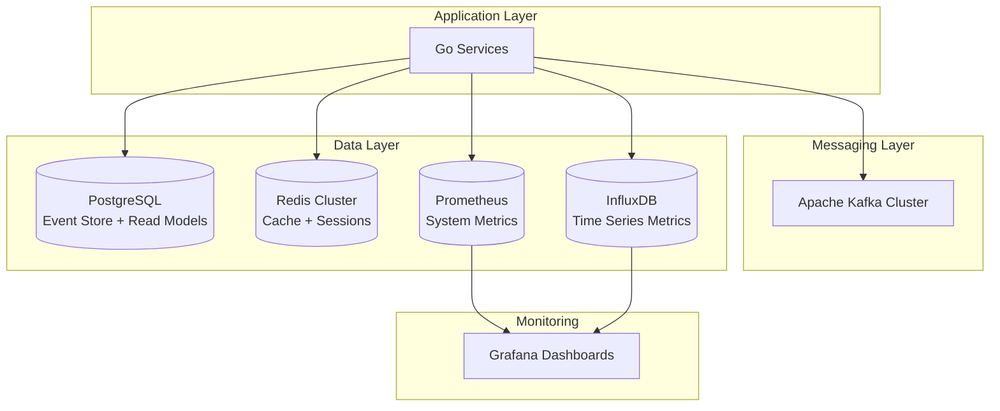

# Recomendación de Stack Tecnológico

## Índice
1. [Resumen Ejecutivo](#resumen-ejecutivo)
2. [Corredor de Mensajes](#corredor-de-mensajes)
3. [Bases de Datos](#bases-de-datos)
4. [Soluciones de Caché](#soluciones-de-caché)
5. [Stack Completo Recomendado](#stack-completo-recomendado)
6. [Consideraciones de Deployment](#consideraciones-de-deployment)

---

## Resumen Ejecutivo

Para el sistema de procesamiento de pagos orientado a eventos, recomiendo el siguiente stack tecnológico:

- **Corredor de Mensajes**: Apache Kafka
- **Event Store**: PostgreSQL con extensiones JSONB
- **Read Models**: PostgreSQL (principal) + Redis (caché)
- **Métricas**: InfluxDB + Prometheus
- **Caché**: Redis Cluster
- **Lenguaje**: Go 1.21+
- **Orquestación**: Kubernetes

---

## Corredor de Mensajes

### Recomendación: Apache Kafka

#### Justificación Técnica

**✅ Ventajas para nuestro caso de uso:**

1. **Alto Throughput y Baja Latencia**
   ```yaml
   Capacidad: >1M mensajes/segundo por broker
   Latencia: <10ms percentil 99
   Escalabilidad: Horizontal sin límites prácticos
   ```

2. **Persistencia Durable**
   ```yaml
   Retención: Configurable por tópico (días/semanas/años)
   Durabilidad: Replicación síncrona entre brokers
   Recovery: Replay completo de eventos históricos
   ```

3. **Garantías de Orden y Entrega**
   ```yaml
   Orden: Garantizado por partición
   Entrega: At-least-once, exactly-once disponible
   Idempotencia: Soporte nativo para producers
   ```

4. **Ecosistema Go Robusto**
   ```go
   // Librerías recomendadas
   - github.com/segmentio/kafka-go (cliente oficial)
   - github.com/confluentinc/confluent-kafka-go (alto rendimiento)
   - Excelente documentación y comunidad activa
   ```

5. **Características Específicas para Pagos**
   ```yaml
   Transacciones: Soporte para exactly-once semantics
   Compactación: Ideal para event sourcing de billeteras
   Particionamiento: Por user_id/wallet_id para orden
   Dead Letter Queues: Manejo de mensajes fallidos
   ```

#### Configuración Recomendada

```yaml
Cluster_Configuration:
  brokers: 3 (mínimo para producción)
  replication_factor: 3
  min_insync_replicas: 2
  
Topic_Configuration:
  payment-events:
    partitions: 12
    retention_ms: 604800000  # 7 días
    cleanup_policy: delete
    
  wallet-events:
    partitions: 8
    retention_ms: 2592000000  # 30 días
    cleanup_policy: compact  # Para event sourcing
    
  saga-events:
    partitions: 6
    retention_ms: 1209600000  # 14 días
    cleanup_policy: delete

Producer_Config:
  acks: "all"
  retries: 2147483647
  max_in_flight_requests_per_connection: 1
  enable_idempotence: true
  compression_type: "lz4"
  
Consumer_Config:
  enable_auto_commit: false
  isolation_level: "read_committed"
  max_poll_records: 500
  session_timeout_ms: 30000
```

#### Comparación con Alternativas

**vs. RabbitMQ:**
```yaml
Kafka_Advantages:
  - Mayor throughput (10x-100x)
  - Mejor para event sourcing (persistencia)
  - Escalabilidad horizontal superior
  - Replay de eventos históricos
  
RabbitMQ_Advantages:
  - Setup más simple
  - Mejor para request-reply patterns
  - Routing más flexible
  
Decisión: Kafka por volumen y persistencia requeridos
```

**vs. NATS/NATS Streaming:**
```yaml
Kafka_Advantages:
  - Ecosistema más maduro
  - Mejor tooling y monitoreo
  - Persistencia más robusta
  - Mejor soporte para event sourcing
  
NATS_Advantages:
  - Menor latencia
  - Menor overhead de recursos
  - Setup más simple
  
Decisión: Kafka por robustez y características enterprise
```

---

## Bases de Datos

### Event Store: PostgreSQL con JSONB

#### Justificación

**✅ Por qué PostgreSQL para Event Store:**

1. **ACID Compliance**
   ```sql
   -- Transacciones atómicas críticas para consistencia
   BEGIN;
   INSERT INTO wallet_events (wallet_id, event_type, event_data, event_version)
   VALUES ($1, $2, $3, $4);
   UPDATE wallet_snapshots SET last_event_version = $4 WHERE wallet_id = $1;
   COMMIT;
   ```

2. **JSONB para Flexibilidad**
   ```sql
   -- Esquema flexible para diferentes tipos de eventos
   CREATE TABLE events (
       event_id UUID PRIMARY KEY,
       aggregate_id UUID NOT NULL,
       event_type VARCHAR(100) NOT NULL,
       event_data JSONB NOT NULL,  -- Esquema flexible
       event_version BIGINT NOT NULL,
       occurred_at TIMESTAMP WITH TIME ZONE NOT NULL
   );
   
   -- Índices GIN para consultas eficientes en JSONB
   CREATE INDEX idx_events_data_gin ON events USING GIN (event_data);
   ```

3. **Consultas Complejas**
   ```sql
   -- Consultas analíticas sobre eventos
   SELECT 
       event_data->>'currency' as currency,
       SUM((event_data->>'amount')::decimal) as total_amount
   FROM events 
   WHERE event_type = 'WalletDeducted'
     AND occurred_at >= NOW() - INTERVAL '24 hours'
   GROUP BY event_data->>'currency';
   ```

4. **Particionamiento Nativo**
   ```sql
   -- Particionamiento por fecha para performance
   CREATE TABLE events_2024_01 PARTITION OF events
   FOR VALUES FROM ('2024-01-01') TO ('2024-02-01');
   ```

#### Configuración Optimizada

```yaml
PostgreSQL_Configuration:
  version: "15+"
  extensions: [uuid-ossp, pgcrypto, pg_stat_statements]
  
Performance_Tuning:
  shared_buffers: "25% of RAM"
  effective_cache_size: "75% of RAM"
  work_mem: "256MB"
  maintenance_work_mem: "2GB"
  checkpoint_completion_target: 0.9
  wal_buffers: "16MB"
  
Connection_Pooling:
  tool: "PgBouncer"
  max_connections: 200
  pool_size: 50
  pool_mode: "transaction"
```

### Read Models: PostgreSQL + Vistas Materializadas

#### Justificación para Read Models

**✅ Por qué PostgreSQL también para Read Models:**

1. **Consistencia de Stack**
   ```yaml
   Ventajas:
     - Un solo sistema de base de datos para mantener
     - Transacciones entre event store y read models
     - Expertise concentrado del equipo
     - Menor complejidad operacional
   ```

2. **Vistas Materializadas para Performance**
   ```sql
   -- Vista materializada para saldos de billetera
   CREATE MATERIALIZED VIEW wallet_balances AS
   SELECT 
       wallet_id,
       user_id,
       currency,
       SUM(CASE 
           WHEN event_type = 'BalanceAdded' THEN (event_data->>'amount')::decimal
           WHEN event_type = 'BalanceDeducted' THEN -(event_data->>'amount')::decimal
           ELSE 0
       END) as current_balance,
       MAX(occurred_at) as last_updated
   FROM wallet_events
   GROUP BY wallet_id, user_id, currency;
   
   -- Índices para consultas rápidas
   CREATE UNIQUE INDEX idx_wallet_balances_pk ON wallet_balances (wallet_id, currency);
   CREATE INDEX idx_wallet_balances_user ON wallet_balances (user_id);
   ```

3. **Refresh Estratégico**
   ```sql
   -- Refresh incremental para performance
   REFRESH MATERIALIZED VIEW CONCURRENTLY wallet_balances;
   
   -- Automatización con triggers o jobs programados
   ```

#### Alternativa: Proyecciones en Tiempo Real

```go
// Event handler para mantener read models actualizados
func (h *WalletEventHandler) HandleWalletDeducted(event WalletDeductedEvent) error {
    // Actualizar read model inmediatamente
    return h.repo.UpdateWalletBalance(event.WalletID, event.NewBalance)
}
```

### Métricas: InfluxDB + Prometheus

#### InfluxDB para Métricas de Series Temporales

**✅ Justificación:**

1. **Optimizado para Series Temporales**
   ```sql
   -- Consultas eficientes para métricas
   SELECT mean(amount) 
   FROM payments 
   WHERE time >= now() - 1h 
   GROUP BY time(5m), currency
   ```

2. **Compresión Automática**
   ```yaml
   Storage_Efficiency:
     - Compresión automática de datos antiguos
     - Retention policies configurables
     - Downsampling para datos históricos
   ```

3. **Integración con Grafana**
   ```yaml
   Dashboards:
     - Métricas de negocio en tiempo real
     - Alertas automáticas
     - Análisis de tendencias
   ```

#### Prometheus para Métricas de Sistema

**✅ Complemento perfecto:**

```yaml
Prometheus_Metrics:
  - Métricas de aplicación (counters, gauges, histograms)
  - Health checks de servicios
  - Métricas de infraestructura
  - Integración nativa con Kubernetes
```

---

## Soluciones de Caché

### Recomendación: Redis Cluster

#### Justificación Técnica

**✅ Casos de uso específicos:**

1. **Caché de Saldos de Billetera**
   ```go
   // Patrón Cache-Aside para saldos frecuentes
   func (s *WalletService) GetBalance(walletID string) (decimal.Decimal, error) {
       // 1. Intentar desde cache
       if balance, err := s.redis.Get(ctx, "wallet:"+walletID).Result(); err == nil {
           return decimal.NewFromString(balance)
       }
       
       // 2. Fallback a base de datos
       balance, err := s.repo.GetBalance(walletID)
       if err != nil {
           return decimal.Zero, err
       }
       
       // 3. Actualizar cache
       s.redis.Set(ctx, "wallet:"+walletID, balance.String(), 5*time.Minute)
       return balance, nil
   }
   ```

2. **Estado de Circuit Breakers**
   ```go
   // Estado distribuido de circuit breakers
   type CircuitBreakerState struct {
       Provider     string
       State        string // CLOSED, OPEN, HALF_OPEN
       FailureCount int
       LastFailure  time.Time
   }
   
   func (cb *CircuitBreaker) GetState(provider string) (*CircuitBreakerState, error) {
       return cb.redis.HGetAll(ctx, "cb:"+provider).Result()
   }
   ```

3. **Cache de Configuración**
   ```yaml
   Configuration_Cache:
     - Reglas de negocio
     - Límites de transacción
     - Configuración de alertas
     - TTL: 10-30 minutos
   ```

4. **Sesiones y Rate Limiting**
   ```go
   // Rate limiting por usuario
   func (rl *RateLimiter) Allow(userID string) bool {
       key := "rate_limit:" + userID
       current := rl.redis.Incr(ctx, key).Val()
       
       if current == 1 {
           rl.redis.Expire(ctx, key, time.Minute)
       }
       
       return current <= 100 // 100 requests por minuto
   }
   ```

#### Configuración Redis Cluster

```yaml
Redis_Cluster:
  nodes: 6 (3 masters, 3 replicas)
  memory_per_node: "8GB"
  persistence: "AOF + RDB"
  
Memory_Optimization:
  maxmemory_policy: "allkeys-lru"
  compression: true
  
High_Availability:
  sentinel: true
  automatic_failover: true
  
Monitoring:
  redis_exporter: true
  prometheus_integration: true
```

#### Patrones de Cache

**1. Cache-Aside (Lazy Loading)**
```go
// Para datos que cambian poco (configuración)
func GetConfig(key string) (Config, error) {
    if cached := cache.Get(key); cached != nil {
        return cached, nil
    }
    
    config := db.GetConfig(key)
    cache.Set(key, config, 30*time.Minute)
    return config, nil
}
```

**2. Write-Through**
```go
// Para datos críticos (saldos)
func UpdateBalance(walletID string, balance decimal.Decimal) error {
    // Actualizar DB y cache atómicamente
    if err := db.UpdateBalance(walletID, balance); err != nil {
        return err
    }
    
    cache.Set("wallet:"+walletID, balance.String(), 5*time.Minute)
    return nil
}
```

**3. Write-Behind (Write-Back)**
```go
// Para métricas no críticas
func RecordMetric(metric Metric) {
    // Escribir a cache inmediatamente
    cache.LPush("metrics_queue", metric)
    
    // Batch write a DB cada 10 segundos (background)
}
```

---

## Stack Completo Recomendado

### Arquitectura de Datos



### Justificación del Stack Unificado

**✅ Ventajas de PostgreSQL como Base Principal:**

1. **Simplicidad Operacional**
   ```yaml
   Beneficios:
     - Un solo sistema de DB para mantener
     - Backup y recovery unificado
     - Expertise concentrado del equipo
     - Menor superficie de ataque de seguridad
   ```

2. **Transacciones Cross-Domain**
   ```sql
   -- Transacción atómica entre event store y read model
   BEGIN;
   INSERT INTO events (...);
   UPDATE wallet_balances SET balance = balance + $1 WHERE wallet_id = $2;
   COMMIT;
   ```

3. **Flexibilidad JSONB**
   ```sql
   -- Esquemas evolutivos sin migraciones complejas
   SELECT event_data->>'new_field' FROM events 
   WHERE event_type = 'PaymentCompleted'
     AND event_data ? 'new_field';
   ```

### Consideraciones de Performance

**Optimizaciones Específicas:**

1. **Particionamiento Temporal**
   ```sql
   -- Particiones mensuales para eventos
   CREATE TABLE events_y2024m01 PARTITION OF events
   FOR VALUES FROM ('2024-01-01') TO ('2024-02-01');
   ```

2. **Índices Especializados**
   ```sql
   -- Para consultas de event sourcing
   CREATE INDEX idx_events_aggregate_version 
   ON events (aggregate_id, event_version);
   
   -- Para consultas analíticas
   CREATE INDEX idx_events_type_time 
   ON events (event_type, occurred_at) 
   WHERE occurred_at >= '2024-01-01';
   ```

3. **Connection Pooling**
   ```yaml
   PgBouncer_Config:
     pool_mode: "transaction"
     max_client_conn: 1000
     default_pool_size: 50
     server_round_robin: 1
   ```

---

## Consideraciones de Deployment

### Containerización

```yaml
Docker_Images:
  - golang:1.21-alpine (base para servicios)
  - postgres:15-alpine
  - redis:7-alpine
  - confluentinc/cp-kafka:latest
  - influxdb:2.7-alpine
  - prom/prometheus:latest
```

### Orquestación Kubernetes

```yaml
Kubernetes_Resources:
  Services:
    - Deployment per microservice
    - HorizontalPodAutoscaler
    - Service mesh (Istio opcional)
    
  Data:
    - StatefulSets para bases de datos
    - PersistentVolumes con SSD
    - Backup automatizado
    
  Monitoring:
    - Prometheus Operator
    - Grafana con dashboards pre-configurados
    - AlertManager para notificaciones
```

### Estimaciones de Recursos

```yaml
Production_Sizing:
  Kafka_Cluster:
    nodes: 3
    cpu: "4 cores per node"
    memory: "16GB per node"
    storage: "1TB SSD per node"
    
  PostgreSQL:
    cpu: "8 cores"
    memory: "32GB"
    storage: "2TB SSD + backup"
    
  Redis_Cluster:
    nodes: 6
    cpu: "2 cores per node"
    memory: "8GB per node"
    
  Go_Services:
    replicas: 3 per service
    cpu: "1 core per replica"
    memory: "2GB per replica"
```

### Monitoreo y Alertas

```yaml
Key_Metrics:
  Business:
    - Payment success rate > 99.5%
    - Average processing time < 2s
    - Wallet balance accuracy 100%
    
  Technical:
    - API response time p99 < 500ms
    - Kafka lag < 1000 messages
    - Database connection pool < 80%
    - Cache hit ratio > 90%
    
  Alerts:
    - Payment failure rate > 1%
    - Circuit breaker opened
    - Database connections exhausted
    - Kafka consumer lag > 10000
```

Este stack tecnológico proporciona una base sólida, escalable y mantenible para el sistema de procesamiento de pagos, balanceando performance, consistencia y simplicidad operacional.

<function_calls>
<invoke name="todo_list">
<parameter name="todos">[{"id": "18", "content": "Crear recomendaci\u00f3n de stack tecnol\u00f3gico con justificaciones para corredor de mensajes, bases de datos, cach\u00e9 y almacenamiento", "status": "completed", "priority": "high"}]
